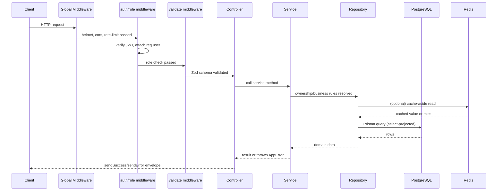
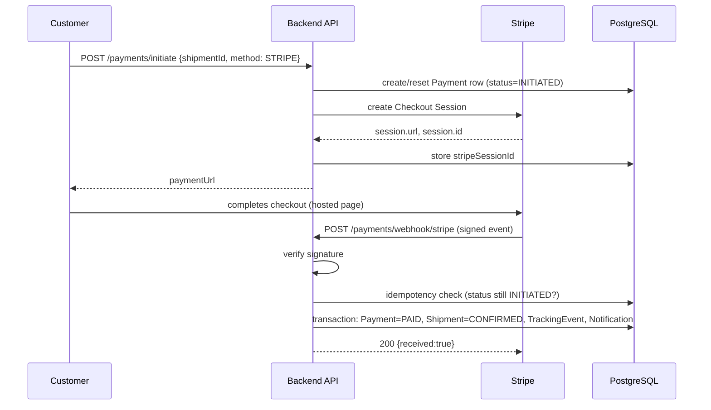
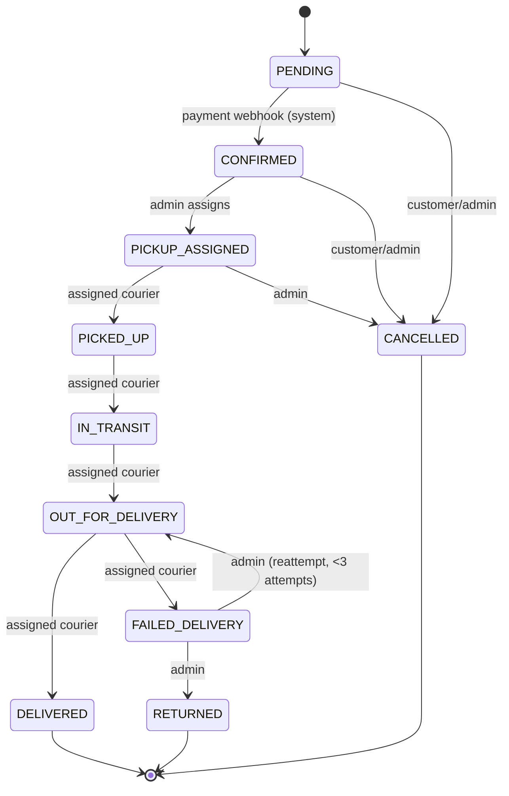

# Implementation Plan — Courier & Logistics Platform Backend

> **Document status:** FINAL — merged and synthesized from six independently produced implementation plans plus the master architectural blueprint (`project_structure.md`, B7A6 Backend Project). This is the single source of truth for building the system.
> **Stack:** Node.js · TypeScript · Express.js · PostgreSQL · Prisma 7 · Zod · Redis · Stripe · bKash
> **Architecture style:** Layered modular monolith — `Controller → Service → Repository → Prisma → PostgreSQL`
> **API surface:** 37 core, meaningful, documented endpoints + 1 bonus health-check endpoint (38 total), all under `/api/v1`
> **Total implementation phases:** 15

---

## 0. Document Purpose

This document is the complete, execution-ready implementation blueprint for the Courier & Logistics Platform backend. It was produced by comparatively analyzing six independent AI-generated implementation plans for the same project (each itself derived from the master architecture document `project_structure.md`), extracting every valuable technique, edge case, and safeguard found in any of them, resolving the places where the plans disagreed, correcting weaker approaches, and organizing the result into one internally consistent plan.

Nothing in this document is invented product scope. Every functional requirement traces back to `project_structure.md`. Where this document adds engineering detail beyond what the source plans specified (e.g., a specific cache-invalidation pattern, a specific concurrency test), that detail is a **technically necessary implementation decision**, not a new feature, and is flagged as such where it might be mistaken for one.

An AI coding agent (or a human developer) should be able to execute Section 15 ("Implementation Phases") top to bottom, phase by phase, using the rest of this document as a reference, and arrive at a complete, correct, gradeable submission without needing to re-interpret ambiguous requirements along the way — every ambiguity found across the six source plans has already been resolved in Section 2 and Section 26.

---

## 1. Project Overview

### 1.1 Business perspective

The Courier & Logistics Platform is a backend system for last-mile and inter-city parcel delivery logistics. It allows **customers** to create and pay for shipments, tracks those shipments through a full logistics lifecycle, allows **admins** to assign **couriers** for pickup and delivery, calculates shipping price server-side from zone/weight/service-type rules, and processes real payments through Stripe and bKash.

**Primary users and their goals:**
- **Customer** — sends parcels: creates a shipment, pays for it, tracks it, can cancel before pickup.
- **Courier** — delivery personnel: sees assigned shipments, advances them through pickup → transit → delivery, records delivery outcomes.
- **Admin** — platform operator: manages users, assigns couriers, manages delivery zones and pricing, monitors the whole platform, reviews the audit trail.

**Major business workflows** (each has a dedicated deep-dive in Section 12):
1. Shipment creation & server-side pricing
2. Payment processing (Stripe + bKash) and payment→shipment status synchronization
3. Courier assignment & dispatch (with reassignment and concurrency protection)
4. Pickup → transit → delivery lifecycle, governed by a strict state machine
5. Failed delivery, reattempt, and return-to-sender workflow
6. Cancellation and refund
7. Tracking (immutable event timeline)
8. Admin operations & platform-wide reporting
9. Immutable audit logging of every critical action
10. In-app notifications

### 1.2 Technical perspective

- **Architecture:** Layered modular monolith — one deployable Express application internally organized into feature modules, each with its own routes → controller → service → repository chain.
- **API style:** RESTful, versioned at `/api/v1/`.
- **Database:** PostgreSQL via Prisma 7 ORM. 10 tables, 6 enums, fully normalized (3NF) with one deliberate, documented denormalization (addresses stored on the shipment, not a separate table).
- **Auth:** JWT (short-lived access + long-lived refresh, with single-use rotation) + bcrypt password hashing + Google OAuth 2.0. Bearer-token authorization on every protected route.
- **Payments:** Stripe Checkout Sessions (test mode) + bKash Tokenized Checkout (sandbox), unified behind a `PaymentGateway` interface, with webhook/callback-only completion.
- **Caching:** Redis, applied narrowly and deliberately to read-heavy, rarely-changing data (delivery zones, pricing rules, dashboard stats), with graceful degradation if Redis is unavailable.
- **Validation:** Zod schemas on every request body/query/params.
- **Deployment:** Render or Vercel (pick one, see Section 22), with Neon Postgres and managed Redis (Upstash). (No local database setup, use Neon for all environments).

### 1.3 What this system deliberately is NOT

Carried forward unanimously from all six source plans and the architecture document itself, the following are **out of scope** and must not be added, even if they seem like natural extensions:

- Not an e-commerce clone (no Cart, Product, or generic Order entities — only logistics-domain entities: Shipment, Parcel, TrackingEvent, DeliveryAttempt, DeliveryZone, PricingRule).
- Not a multi-organization / multi-tenant platform.
- Not a complex hub-to-hub routing engine (hub concepts are simplified to zone-based logistics and status transitions only).
- No courier earnings/payout subsystem (payments go to the platform, not direct courier payouts).
- No real-time WebSocket notifications (in-app, pull-based notifications only).
- No full analytics/BI engine (a single dashboard-stats endpoint is sufficient).
- No queue/worker infrastructure (BullMQ, etc.), no Elasticsearch, no read replicas, no PgBouncer — these are explicitly named in the source architecture as **future production improvements**, not required for this assignment. See Section 28.
- No Cash on Delivery, no "pay later," and no fake/simulated/manually-confirmed payment path, under any circumstance, framing, or environment flag. This is the single most safety-critical constraint in the entire project (see Section 2.1, item 3).

---

## 2. Implementation Contract

This section is the normative contract every phase, every file, and every line of business logic must satisfy. It is deliberately placed before the architecture and phase sections because — per the comparative analysis of the six source plans — the single biggest risk to this project is a technically-correct-looking implementation that quietly violates one of these constraints. Treat this section as overriding any other instruction in this document if the two ever appear to conflict.

### 2.1 Non-negotiable constraints

1. **Exactly three primary roles exist, forever:** `CUSTOMER`, `COURIER`, `ADMIN`. Never add a Hub Manager, Operations Manager, or any other role, even though the original idea-hub brainstorm considered five roles — the assignment is explicit that exactly three roles are required (project_structure.md, R-01, C.4).
2. **Payments must use real gateways:** Stripe Checkout in test mode, bKash Tokenized Checkout in sandbox. Test/sandbox credentials satisfy the "real payment integration" requirement; simulated/mocked gateways do not (R-02, C.2).
3. **The implementation must never contain:**
   - a Cash-on-Delivery payment method or enum value;
   - a "pay later" concept;
   - any fake or simulated payment processing;
   - any manual endpoint or admin action that sets `payment.status = 'PAID'`;
   - any `if (NODE_ENV === 'development') payment.status = 'PAID'`-style shortcut, ever, in any file, including test fixtures that could accidentally run against production code paths.
   (C.1, C.2, R-03, R-04 — violation of this rule risks **zero marks** on the assignment.)
4. **Only two code paths may ever transition a payment to `PAID`:** the Stripe webhook handler and the bKash callback handler. No other function, anywhere in the codebase, may write `status: 'PAID'` to the `payments` table.
5. **All API routes use the `/api/v1` prefix** and RESTful naming conventions (R-09, R-32, NFR-10, NFR-14).
6. **All responses — success and error — use the documented JSON response envelope** (Section 10.2). No controller may call `res.json()` with an ad-hoc shape (R-10, NFR-11 — this is a **zero-marks-if-missing** requirement).
7. **All request input (body, query, params) is validated server-side with Zod** before it reaches a controller (R-11, NFR-12).
8. **Resource ownership is enforced in the service layer**, never assumed from frontend behavior and never delegated entirely to middleware (Section 11 of project_structure.md).
9. **Soft deletes** are used for `User`, `Shipment`, and `DeliveryZone` via a nullable `deletedAt` timestamp, auto-filtered by a Prisma Client Extension (R-12, C.7).
10. **`AuditLog` and `TrackingEvent` are immutable and append-only.** No repository method for either table may implement `update` or `delete` (R-13, C.8, Section 20 note).
11. **Every shipment status transition passes through one centralized state-machine validator** (`shipment.state-machine.ts`). No route or service method may mutate `shipment.status` by any other path (AR-09).
12. **Database transactions (`prisma.$transaction`)** wrap every multi-record business operation identified in Section 9 of `project_structure.md` and enumerated in Section 8.6 of this document (R-26, NFR-09).
13. **Prisma queries use explicit `select` projections.** `password` and `refreshToken` must never appear in any API response, under any role, under any circumstance (T-12).
14. **List endpoints support pagination, and the page size is hard-capped at 50** regardless of what the client requests (R-15, Section 25 of project_structure.md).
15. **The platform implements all 37 documented endpoints** (plus the bonus health check) — comfortably exceeding the ≥20-endpoint minimum (R-08, FR-43) with meaningful, non-duplicate, fully documented routes. Do not pad the count with a fabricated endpoint (see Section 2.3, item 2, for the one place the source document's own endpoint tally is internally inconsistent).
16. **Server calculates price. The client never submits a price.** `estimatedPrice` is always server-computed from `PricingRule` data at shipment-creation time (BR-014).
17. **Domain terminology is logistics-specific, never e-commerce-specific.** Use `Shipment`, `Parcel`, `TrackingEvent`, `DeliveryAttempt`, `DeliveryZone`, `PricingRule` — never `Cart`, `Product`, or a generic `Order` (R-05, C.3).

### 2.2 Definition of done for every phase

A phase is complete only when **all** of the following hold:

- Every file specified in the phase exists at the documented path.
- The implementation respects layer boundaries: controllers contain no business logic; services never touch `req`/`res`; repositories contain no business rules, only data access.
- `npx tsc --noEmit` reports zero errors.
- Lint/format checks pass with zero errors.
- Every business/security invariant listed for that phase (state-machine correctness, ownership checks, idempotency, etc.) has been manually or automatically verified — not merely "written and assumed correct."
- No secret, test shortcut, or fake integration has been introduced anywhere in the diff.
- The phase's own **Completion Criteria** checklist (given at the end of each phase in Section 15) is fully checked off.
- A meaningful, descriptive git commit has been made (see Section 21.3) — across 15 phases this comfortably clears the ≥20-commit requirement (FR-42) without needing artificial commit-count padding.

### 2.3 Resolving ambiguities and internal inconsistencies in the source architecture

The source architecture document (`project_structure.md`) is authoritative, but — as identified independently by multiple of the six source plans — it contains a small number of places where it describes the same thing at two levels of detail that don't perfectly agree, or where prose intent and the literal endpoint/schema catalog diverge slightly. Each is resolved explicitly here so no phase has to re-litigate it:

1. **"Shipment CRUD" vs. the original 8-endpoint catalog.** The requirements table (FR-13) says "Shipment CRUD operations," and the assignment's example API structure explicitly lists `PATCH /api/v1/resources/:id` and `DELETE /api/v1/resources/:id # Soft delete` under Core Resources. The README (line 120) also requires the video to demonstrate `POST, GET, PATCH/PUT, DELETE`. The original detailed catalog defined only 8 shipment endpoints with no generic edit or delete route. **Resolution:** add `PATCH /api/v1/shipments/:id` (general edit, restricted to `PENDING`-status shipments with a strict field whitelist and server-side price recalculation) and `DELETE /api/v1/shipments/:id` (soft delete, restricted to `PENDING` or `CANCELLED` shipments). This closes the CRUD gap without creating a security hole — see Section 11.5 and Section 12.9 for the full specification. The shipment module now has 10 endpoints.
2. **Payment module endpoint count: "6" vs. 5 documented routes.** The source document's endpoint-count summary table states the Payments module has 6 endpoints, but Section 10 of the same document only enumerates 5 payment routes (`initiate`, `webhook/stripe`, `webhook/bkash`, `GET /:id`, `GET /shipment/:shipmentId`). **Resolution:** implement exactly these 5 routes. Do not fabricate a 6th payment endpoint merely to force the tally to match — R-08's own stated risk is *padding with dummy endpoints*, which would violate the requirement's spirit even while superficially satisfying its letter. The platform's true endpoint count is **37 core + 1 bonus health check = 38 total routes**, which still clears the ≥20 minimum by a wide margin.
3. **`Payment.status` enum has no `PENDING` value, but prose sometimes says a shipment is "pending payment."** The `PaymentStatus` enum is `INITIATED | PAID | FAILED | REFUNDED | EXPIRED`. **Resolution:** "pending payment" in prose refers to the *shipment's* status (`ShipmentStatus.PENDING`), not the payment row's status, which starts life as `INITIATED` once a Payment record is created. Never introduce a `PENDING` value into `PaymentStatus`.
4. **Courier reassignment is not a shipment state-machine transition.** `PICKUP_ASSIGNED → PICKUP_ASSIGNED` is not a "transition" in the formal sense (the `from` and `to` states are identical) — it is a courier-swap operation with its own explicit guard (`status === 'PICKUP_ASSIGNED'`), handled entirely inside the assignment service, never inside `isValidTransition`. See Section 12.3.
5. **Refunds are not literally atomic database operations, because they involve an external network call.** The correct sequencing is: (a) call the gateway's refund API and wait for a successful response; (b) only then, inside a database transaction, persist `Payment.status = 'REFUNDED'`. Never mark a payment `REFUNDED` speculatively before the gateway confirms success, and never wrap the outbound HTTP call itself inside `prisma.$transaction` (a Prisma transaction should not hold open across a slow external network round-trip).
6. **Courier `serviceArea` vs. shipment origin zone — assignment validation.** Two parts of the source document describe this slightly differently: Section 5.2's validation table for the `PICKUP_ASSIGNED` stage explicitly lists *"courier must serve the origin zone"* as a validation rule, while Section 15's system-validation checklist (step 4) lists only `isActive`, `role === COURIER`, `isAvailable`, and shipment status — omitting the service-area check from that specific enumerated list (though step 2 separately describes it as a *filter* the admin uses when browsing available couriers). **Resolution:** treat Section 5.2's validation table as authoritative — service-area matching is a genuine, enforced validation rule at assignment time, not merely an admin-UI convenience filter. The assignment service must reject assignment with a `BusinessRuleError` if `courier.serviceArea` does not match the shipment's origin zone name (case-insensitive comparison). This is implemented in Section 12.5 and Phase 9. (This resolves a genuine internal inconsistency in the source document, identified during cross-referencing of the six independent plans against the source — two of the six plans caught this validation rule and four missed it.)
7. **Mass-assignment defense on `PATCH /users/me`: reject vs. silently strip.** The six source plans split between two defensible approaches: (a) reject the request outright with a `400` if it contains any field outside the whitelist (via Zod `.strict()`), or (b) silently ignore courier-only fields (`serviceArea`, `isAvailable`) when submitted by a non-courier, while still rejecting genuinely dangerous fields like `role` via `.strict()`. **Resolution (adopted from the stricter of the two approaches):** use `.strict()` so that *any* unknown field — including `role`, `isActive`, `deletedAt`, `refreshToken`, or any other non-whitelisted field — is rejected with a `400` validation error. This is the more predictable, more testable, more secure behavior, and it treats "the client sent something it shouldn't have" as a genuine error rather than a silently-ignored no-op. Courier-only fields (`serviceArea`, `isAvailable`) are accepted by the schema for any role but only *persisted* for `COURIER`-role users; for other roles they are accepted-but-ignored at the service layer (this specific pair of fields, and only this pair, is deliberately tolerant, because a customer submitting a profile update that happens to include an empty/default courier field should not be treated as an attack — whereas an unknown field like `role` always is).
8. **Prisma money fields: `Decimal`, never `Float`.** One of the six source plans modeled `estimatedPrice`, `basePrice`, `pricePerKg`, etc. as Prisma `Float`. **Resolution: rejected.** The source architecture explicitly specifies `DECIMAL(10,2)` / `DECIMAL(8,2)` for every money and weight field (Section 7 of `project_structure.md`), and `Float` introduces real floating-point rounding risk for currency math. Use Prisma `Decimal` with explicit `@db.Decimal(precision, scale)` everywhere money or weight is stored, exactly as specified in Section 7.
9. **Gateway reference IDs should be unique, not merely indexed.** The source document's table definitions mark `stripeSessionId`, `bkashPaymentId`, etc. as indexed but not explicitly `@unique`. **Resolution (adopted as a strengthening, not a scope change):** add `@unique` to `stripeSessionId`, `stripePaymentIntentId`, `bkashPaymentId`, and `bkashTrxId` where non-null, since two payments can never legitimately share a gateway reference — this is a data-integrity improvement fully compatible with the documented schema's intent, not a new feature.

### 2.4 Execution discipline for the implementing agent

1. Work one phase at a time, in the order given in Section 15. Do not skip ahead.
2. Before modifying any file, view its current contents.
3. Reuse shared utilities (Section 7, Section 9) instead of writing duplicate helpers inside a module.
4. Never let business logic (pricing math, state-transition rules, ownership checks, concurrency guards, payment rules) leak into a controller.
5. Never return a raw Prisma record where an explicit safe projection exists — always route through the module's canonical `select` object (e.g., `PUBLIC_USER_SELECT`).
6. Never add an undocumented role, table, or endpoint without a direct requirement citation from `project_structure.md` or an explicit decision record in Section 26.
7. Never create a manual payment-confirmation code path, in production code or in a test helper that could accidentally be reachable from a route.
8. Use gateway sandbox/test credentials for all payment testing — never a homemade payment simulator.
9. Keep `TrackingEvent` and `AuditLog` insert-only, permanently.
10. Use `prisma.$transaction` exactly where Section 8.6 requires it — no more (unnecessary transactions around single-table single-row writes add overhead for no benefit), no less.
11. After each phase: run the build, run the linter, run the phase's tests/manual verification, and only then commit and proceed.
12. When the source architecture is internally ambiguous, follow Section 2.3's resolutions rather than inventing a new interpretation.
13. Before final submission, re-run the full compliance audit in Section 27.

---

## 3. Consolidated Requirements

### 3.1 Functional requirements summary

| Area | Requirement | Priority |
|---|---|---|
| Auth | Email/password registration and login | MUST |
| Auth | Google OAuth (GCP social login) | MUST |
| Auth | Bearer token auth on all protected routes | MUST |
| Auth | Exactly 3 roles with strict RBAC | MUST |
| Auth | Refresh token rotation + logout invalidation | MUST |
| User | Registration, profile view/update | MUST |
| User | Admin user management incl. role updates | MUST |
| Core resources | Shipment/parcel CRUD: the 10 documented shipment endpoints (create, list, search, get, tracking, status-update, cancel, assign, general edit, soft-delete) | MUST |
| Core resources | Soft deletes on User/Shipment/DeliveryZone | MUST |
| Core resources | Audit logs for critical actions | MUST |
| Business ops | Status transitions via centralized state machine | MUST |
| Business ops | Courier assignment/reassignment | MUST |
| Business ops | Server-side pricing calculation | MUST |
| Business ops | Pickup scheduling (folded into shipment creation) | RECOMMENDED → implemented |
| Business ops | Tracking timeline | RECOMMENDED → implemented |
| Business ops | Failed delivery + return-to-sender workflow | RECOMMENDED → implemented |
| Business ops | Zone management | RECOMMENDED → implemented |
| Search/pagination | ≥1 paginated list endpoint | MUST |
| Search/pagination | ≥1 filterable/sortable list endpoint | MUST |
| Search/pagination | Search functionality where relevant | MUST |
| Payments | Real gateway integration (Stripe + bKash) | MUST — zero marks if missing |
| Payments | Initiation, success/cancel handling, status tracking, webhook verification | MUST |
| Admin | User management, dashboard stats, audit log viewing | MUST |
| Additional (optional, evaluated and excluded/simplified) | Courier earnings — excluded; Notifications — included, minimal, in-app only; Analytics — simplified to one stats endpoint; Multi-org — excluded | per Section 1.3 |
| Docs/deploy | Postman/Swagger docs | MUST — zero marks if missing |
| Docs/deploy | Live deployed API URL | MUST |
| Docs/deploy | ≥20 meaningful commits | MUST |
| Docs/deploy | ≥20 meaningful, documented endpoints | MUST |

### 3.2 Non-functional requirements summary

| Area | Requirement | Priority |
|---|---|---|
| Security | bcrypt password hashing (12 rounds) | MUST |
| Security | Secrets never exposed (env-based, gitignored) | MUST |
| Security | Rate limiting (`express-rate-limit`) | MUST |
| Security | Security headers (`helmet`) | MUST |
| Security | CORS configuration (no wildcard + credentials) | MUST |
| Performance | Database indexing on frequently-queried fields | MUST |
| Performance | Efficient Prisma queries (`select` projections) | MUST |
| Performance | Redis caching | SHOULD |
| Performance | Database transactions for multi-step/concurrent operations | MUST |
| API | Versioning (`/api/v1/...`) | MUST |
| API | Consistent JSON response envelope | MUST — zero marks if missing |
| API | Server-side validation with structured errors | MUST |
| Data | Correct relationships/constraints/indexing/transactions | MUST |
| API | RESTful naming | MUST |
| Code | Modular architecture, clean code | SHOULD |
| Files | File/image upload (Multer/Cloudinary) | OPTIONAL — not implemented (no feature in scope requires it) |
| Ops | Structured logging | RECOMMENDED |
| Ops | Request correlation IDs | OPTIONAL — implemented (see Section 18.2) |
| Ops | Health check endpoint | RECOMMENDED → implemented |
| Ops | Graceful global error handling | MUST (implied) |
| Ops | Environment configuration management | MUST (implied) |

### 3.3 User roles

See Section 9 for the complete role/permission matrix. Summary:

- **CUSTOMER** — creates and pays for shipments, tracks and cancels (pre-pickup) their own shipments, views their own payment history and notifications, manages their own profile. Cannot see other customers' data, cannot assign couriers, cannot change shipment status directly, cannot access admin data.
- **COURIER** — views and advances shipments assigned to them through the delivery lifecycle, records delivery attempts, manages their own availability/service-area profile. Cannot create shipments, cannot self-assign, cannot see unassigned or other couriers' shipments, cannot see payment details.
- **ADMIN** — admin user management (list, view, role update, soft delete/deactivate), assigns/reassigns couriers, full CRUD on zones and pricing, full read access to all shipments/payments/audit logs, platform statistics. Cannot delete audit logs (immutable), cannot manually set payment status, should not create shipments on customers' behalf.

### 3.4 Core capabilities (system-level)

1. Dual-mode authentication (password + OAuth) with short-lived access tokens and rotating refresh tokens.
2. A fully modeled, strictly enforced shipment lifecycle state machine spanning 10 states with role-gated transitions.
3. Server-computed, zone-and-service-type-based pricing with a documented fallback rule.
4. An immutable, append-only tracking timeline reconstructable per shipment.
5. Concurrency-safe courier assignment using optimistic locking.
6. Dual real payment gateway integration with webhook-exclusive completion and idempotent processing.
7. Gateway-verified refunds tied to shipment cancellation.
8. An immutable audit trail covering every critical state change across the platform.
9. In-app, pull-based notifications tied to the same trigger events as the audit trail.
10. Role-scoped, paginated, filterable, searchable listing across every list-producing endpoint.
11. Redis-backed caching for the platform's few genuinely read-heavy, slow-changing datasets, with fallback-to-database resilience.

---

## 4. Final Architecture

### 4.1 Architecture overview

**Layered Modular Monolith.** One deployable Express/Node process, internally partitioned into self-contained feature modules (`auth`, `user`, `shipment`, `parcel`, `tracking`, `payment`, `zone`, `pricing`, `admin`, `notification`, `audit`), each following the same internal layering:

```
Request
  │
  ▼
Middleware pipeline (helmet, cors, rate-limit, body-parser, auth, role, validate)
  │
  ▼
Controller  ─── parses req, calls service, formats response via sendSuccess/sendError
  │                (contains ZERO business logic)
  ▼
Service     ─── business rules, ownership checks, state-machine checks, orchestration,
  │                transactions, calls into audit/notification services
  ▼
Repository  ─── Prisma calls only; no business rules; explicit `select`; pagination/filter/sort
  │
  ▼
Prisma Client (soft-delete extension) ─── PostgreSQL
```

External systems the backend talks to: PostgreSQL (via Prisma), Redis (cache + token blacklist), Stripe API, bKash API, Google OAuth token-verification endpoint.

### 4.2 Architectural principles

1. **Strict layer separation.** A controller never imports Prisma. A repository never throws a `BusinessRuleError`. A service never touches `req`/`res`.
2. **Single source of truth per concern.** One state-machine module governs all shipment transitions. One response-utility pair (`sendSuccess`/`sendError`) governs all HTTP responses. One Prisma client (with the soft-delete extension) is imported everywhere — never instantiate a second `PrismaClient`.
3. **Fail loud at startup, fail quiet (but logged) at runtime.** Environment misconfiguration crashes the process immediately with a clear message (Section 7.1). A transient Redis outage degrades gracefully rather than crashing a request (Section 16.5).
4. **Ownership and business rules live in the service layer, never in middleware or the frontend.** Middleware only answers "is this a valid token, and does this role have any access to this route category at all" — never "does this specific user own this specific resource."
5. **Payment status is a one-way, gateway-verified door.** No convenience shortcut is ever added to this rule (Section 2.1, items 3–4).
6. **Everything that changes shared state as a multi-step operation is transactional** (Section 8.6).

### 4.3 System components

| Component | Responsibility |
|---|---|
| Express app (`app.ts`) | HTTP surface, global middleware pipeline, route mounting |
| 11 feature modules (`src/modules/*`) | Business domains, each with routes/controller/service/repository/validation |
| Shared middleware (`src/middleware`) | Auth, RBAC, Zod validation, rate limiting, error handling, 404 |
| Shared utilities (`src/shared`) | Errors, response envelope, JWT, hashing, pagination, tracking-number gen, logger, cache helper, constants, types |
| Prisma layer (`src/shared/prisma`, `prisma/schema.prisma`) | Schema, migrations, soft-delete extension, seed script |
| Redis layer (`src/redis`) | Cache client, token blacklist, cache-aside helper with graceful degradation |
| Payment gateways (`src/modules/payment/gateways`) | Stripe and bKash concrete implementations behind one interface |
| PostgreSQL | System of record |
| Redis | Cache + auth blacklist (not system of record for anything) |
| Stripe / bKash | External payment processors |
| Google OAuth | External identity verification |

### 4.4 Component communication & request lifecycle



### 4.5 Payment data flow (Stripe example — bKash is structurally identical with different gateway calls)



### 4.6 Shipment status flow (see Section 12.2 for the full transition table)



---

## 5. Technology Stack

| Layer | Choice | Rationale |
|---|---|---|
| Runtime | Node.js ≥20.19.0 (recommend 22.x LTS) | Required by Prisma 7; Node 18 is NOT supported |
| Language | TypeScript (`strict: true`) | Type safety across a large, multi-module codebase |
| Web framework | Express.js | Required by the assignment stack; simple, well-understood middleware model |
| Database | PostgreSQL | Relational integrity, transactions, and rich indexing are central requirements; the domain is highly relational (shipments↔users↔zones↔payments) |
| ORM | Prisma 7 | Type-safe queries, migrations, Client Extensions for soft-delete auto-filtering |
| Validation | Zod | Runtime validation with static type inference, integrates cleanly with Express middleware |
| Cache | Redis (`ioredis`) | Simple key/value cache-aside for zones, pricing, dashboard stats; also backs the logout token blacklist |
| Auth | `jsonwebtoken` + `bcrypt` + `google-auth-library` | Industry-standard JWT + hashing; official Google token verification library |
| Payments | `stripe` SDK + `axios` (bKash REST) | Stripe has an official SDK; bKash is a plain REST API, so `axios` is used directly behind the gateway interface |
| Security middleware | `helmet`, `cors`, `express-rate-limit` | Directly required by NFR-03/04/05 |
| Logging | `winston` (or `pino`) | Structured JSON logs in production, readable logs in development |
| Dev tooling | `tsx` (ESM-compatible), ESLint + Prettier (or Biome) | Fast reload loop; consistent code style; `ts-node-dev` does not support ESM well |
| Testing | Jest (or Vitest) + Supertest | Unit + integration + concurrency testing (Section 19) |
| Deployment | Render or Vercel | Both explicitly named in the source architecture; pick one and commit to it (Section 22) |
| Managed Postgres | Neon | Using Neon Postgres for all environments (no local DB setup) |
| Managed Redis | Upstash | Named in the source architecture as the default choice |

**Explicitly not part of the stack** (see Section 1.3 and Section 28): BullMQ, Elasticsearch, PgBouncer, WebSockets, a frontend framework (this is a backend-only assignment), a vector database, any AI/ML component.

---

## 6. Project Structure

```text
.
├── .env                          # local secrets — NEVER committed
├── .env.example                  # template with every variable, safe placeholder values
├── .gitignore
├── package.json
├── tsconfig.json
├── .eslintrc.json / eslint.config.js
├── .prettierrc
├── README.md
├── docs/
│   └── postman/                  # exported Postman collection + environment
│
├── prisma/
│   ├── schema.prisma
│   ├── migrations/
│   └── seed.ts
│
├── prisma.config.ts                  # Prisma 7 CLI configuration (schema path, DB URL, seed command)
│
├── src/
│   ├── app.ts                    # Express app assembly (no route-less placeholder after Phase 3)
│   ├── server.ts                 # process bootstrap, listen, graceful shutdown
│   │
│   ├── config/
│   │   ├── index.ts              # single re-export point for all config
│   │   ├── env.ts                # Zod-validated environment
│   │   ├── cors.ts
│   │   ├── stripe.ts
│   │   └── bkash.ts
│   │
│   ├── modules/
│   │   ├── auth/
│   │   │   ├── auth.routes.ts
│   │   │   ├── auth.controller.ts
│   │   │   ├── auth.service.ts
│   │   │   ├── auth.validation.ts
│   │   │   └── google-oauth.service.ts
│   │   │
│   │   ├── user/
│   │   │   ├── user.routes.ts
│   │   │   ├── user.controller.ts
│   │   │   ├── user.service.ts
│   │   │   ├── user.repository.ts        # PUBLIC_USER_SELECT lives here — reused everywhere
│   │   │   └── user.validation.ts
│   │   │
│   │   ├── shipment/
│   │   │   ├── shipment.routes.ts
│   │   │   ├── shipment.controller.ts
│   │   │   ├── shipment.service.ts
│   │   │   ├── shipment.repository.ts
│   │   │   ├── shipment.validation.ts
│   │   │   ├── shipment.state-machine.ts
│   │   │   └── delivery-attempt.repository.ts
│   │   │
│   │   ├── parcel/
│   │   │   └── parcel.validation.ts      # parcel is created/read only via shipment; no own routes
│   │   │
│   │   ├── tracking/
│   │   │   ├── tracking.service.ts
│   │   │   └── tracking.repository.ts    # routes mounted from shipment.routes.ts
│   │   │
│   │   ├── payment/
│   │   │   ├── payment.routes.ts
│   │   │   ├── payment.controller.ts
│   │   │   ├── payment.service.ts
│   │   │   ├── payment.repository.ts
│   │   │   ├── payment.validation.ts
│   │   │   ├── gateways/
│   │   │   │   ├── payment-gateway.interface.ts
│   │   │   │   ├── stripe.gateway.ts
│   │   │   │   └── bkash.gateway.ts
│   │   │   ├── stripe.webhook.ts
│   │   │   └── bkash.webhook.ts
│   │   │
│   │   ├── zone/
│   │   │   ├── zone.routes.ts
│   │   │   ├── zone.controller.ts
│   │   │   ├── zone.service.ts
│   │   │   ├── zone.repository.ts
│   │   │   └── zone.validation.ts
│   │   │
│   │   ├── pricing/
│   │   │   ├── pricing.routes.ts
│   │   │   ├── pricing.controller.ts
│   │   │   ├── pricing.service.ts
│   │   │   ├── pricing.repository.ts
│   │   │   └── pricing.validation.ts
│   │   │
│   │   ├── admin/
│   │   │   ├── admin.routes.ts
│   │   │   ├── admin.controller.ts
│   │   │   ├── admin.service.ts
│   │   │   └── admin.validation.ts
│   │   │
│   │   ├── notification/
│   │   │   ├── notification.service.ts
│   │   │   └── notification.repository.ts   # routes mounted from user.routes.ts
│   │   │
│   │   └── audit/
│   │       ├── audit.service.ts
│   │       └── audit.repository.ts          # read route mounted from admin.routes.ts
│   │
│   ├── middleware/
│   │   ├── auth.middleware.ts
│   │   ├── role.middleware.ts
│   │   ├── validate.middleware.ts
│   │   ├── rate-limit.middleware.ts
│   │   ├── request-logger.middleware.ts     # morgan → winston bridge, request-id tagging
│   │   ├── error-handler.middleware.ts
│   │   └── not-found.middleware.ts
│   │
│   ├── shared/
│   │   ├── errors/
│   │   │   ├── AppError.ts
│   │   │   ├── ValidationError.ts
│   │   │   ├── AuthenticationError.ts
│   │   │   ├── AuthorizationError.ts
│   │   │   ├── NotFoundError.ts
│   │   │   ├── ConflictError.ts
│   │   │   ├── BusinessRuleError.ts
│   │   │   └── index.ts
│   │   │
│   │   ├── utils/
│   │   │   ├── response.ts
│   │   │   ├── jwt.ts
│   │   │   ├── hash.ts
│   │   │   ├── tracking-number.ts
│   │   │   ├── pagination.ts
│   │   │   ├── cache.ts               # getOrSetCache / invalidateCache, Redis-outage-safe
│   │   │   └── logger.ts
│   │   │
│   │   ├── types/
│   │   │   ├── express.d.ts
│   │   │   └── index.ts
│   │   │
│   │   ├── constants/
│   │   │   ├── roles.ts
│   │   │   ├── shipment-status.ts
│   │   │   ├── audit-actions.ts
│   │   │   └── notification-types.ts
│   │   │
│   │   └── prisma/
│   │       └── client.ts              # singleton Prisma client + soft-delete extension
│   │
│   └── redis/
│       └── client.ts
│
└── tests/
    ├── unit/
    │   ├── state-machine.test.ts
    │   ├── pricing.test.ts
    │   ├── jwt.test.ts
    │   └── pagination.test.ts
    ├── integration/
    │   ├── auth.test.ts
    │   ├── shipment.test.ts
    │   ├── payment.test.ts
    │   └── admin.test.ts
    └── concurrency/
        ├── assignment-race.test.ts
        └── webhook-idempotency.test.ts
```

**Directory responsibility notes:**
- `src/modules/*` — one directory per business domain; nothing outside a module's own directory may import its `.repository.ts` file directly except that module's own `.service.ts` (services are the only consumers of repositories; controllers are the only consumers of services).
- `src/shared/*` — anything imported by two or more modules lives here. If a helper is only ever used by one module, it stays inside that module's directory, not in `shared`.
- `parcel` and `tracking` are "sub-modules" of `shipment` in terms of routing (no independent top-level route prefix) but keep their own repository/service files for separation of concerns, matching the source architecture's module diagram.
- `notification` and `audit` are cross-cutting services with no independent route prefix of their own — `notification`'s two routes live under `/users/me/notifications`, and `audit`'s one route lives under `/admin/audit-logs`.

---

## 7. Database Architecture

### 7.1 Entity-relationship overview

```text
User ──1:N──> Shipment (as customer)              [customerId FK, Restrict]
User ──1:N──> Shipment (as courier, nullable)      [courierId FK, SetNull]
DeliveryZone ──1:N──> Shipment (origin)            [originZoneId FK, Restrict]
DeliveryZone ──1:N──> Shipment (destination)       [destinationZoneId FK, Restrict]
Shipment ──1:1──> Parcel                           [shipmentId FK, unique, Cascade]
Shipment ──1:N──> TrackingEvent                    [shipmentId FK, Cascade]
Shipment ──1:N──> DeliveryAttempt                  [shipmentId FK, Cascade]
Shipment ──1:1──> Payment                          [shipmentId FK, unique, Cascade]
User ──1:N──> TrackingEvent (as actor, nullable)   [actorId FK, SetNull]
User ──1:N──> DeliveryAttempt (as courier)         [courierId FK, Restrict]
User ──1:N──> Notification                         [userId FK, Cascade]
User ──1:N──> AuditLog (as actor, nullable)        [actorId FK, SetNull]
DeliveryZone ──1:N──> PricingRule (nullable zone = default rule) [zoneId FK, Cascade]
```

### 7.2 Complete Prisma schema

This is the definitive, final schema. It is built once in Phase 2 and never structurally changed afterward — every later phase only *consumes* it.

```prisma
generator client {
  provider = "prisma-client-js"
  output   = "../src/generated/prisma"
}

datasource db {
  provider = "postgresql"
  url      = env("DATABASE_URL")
}

// ───────────────────────────── ENUMS ─────────────────────────────

enum Role {
  CUSTOMER
  COURIER
  ADMIN
}

enum ShipmentStatus {
  PENDING
  CONFIRMED
  PICKUP_ASSIGNED
  PICKED_UP
  IN_TRANSIT
  OUT_FOR_DELIVERY
  DELIVERED
  FAILED_DELIVERY
  RETURNED
  CANCELLED
}

enum ServiceType {
  STANDARD
  EXPRESS
}

enum PaymentStatus {
  INITIATED
  PAID
  FAILED
  REFUNDED
  EXPIRED
}

enum PaymentMethod {
  STRIPE
  BKASH
}

enum DeliveryAttemptStatus {
  SUCCESS
  FAILED
}

// ───────────────────────────── MODELS ─────────────────────────────

model User {
  id           String    @id @default(uuid()) @db.Uuid
  email        String    @unique @db.VarChar(255)
  password     String?   @db.VarChar(255)          // nullable: OAuth-only users
  name         String    @db.VarChar(100)
  phone        String?   @db.VarChar(20)
  role         Role      @default(CUSTOMER)
  avatar       String?
  googleId     String?   @unique @db.VarChar(255)
  isActive     Boolean   @default(true)
  isAvailable  Boolean   @default(true)             // courier availability flag
  serviceArea  String?   @db.VarChar(100)           // courier's operating zone (matches DeliveryZone.name)
  refreshToken String?                              // stores a bcrypt HASH, never the raw token
  createdAt    DateTime  @default(now())
  updatedAt    DateTime  @updatedAt
  deletedAt    DateTime?

  shipmentsAsCustomer Shipment[]        @relation("CustomerShipments")
  shipmentsAsCourier  Shipment[]        @relation("CourierShipments")
  trackingEventsActed TrackingEvent[]
  deliveryAttempts    DeliveryAttempt[]
  notifications       Notification[]
  auditLogs           AuditLog[]

  @@index([email])
  @@index([role])
  @@index([googleId])
  @@index([deletedAt])
  @@map("users")
}

model Shipment {
  id                 String         @id @default(uuid()) @db.Uuid
  trackingNumber     String         @unique @db.VarChar(20)   // CLG-YYYYMMDD-XXXXX
  customerId         String         @db.Uuid
  courierId          String?        @db.Uuid
  status             ShipmentStatus @default(PENDING)
  originAddress      String
  originCity         String         @db.VarChar(100)
  originZoneId       String         @db.Uuid
  destinationAddress String
  destinationCity    String         @db.VarChar(100)
  destinationZoneId  String         @db.Uuid
  recipientName      String         @db.VarChar(100)
  recipientPhone     String         @db.VarChar(20)
  serviceType        ServiceType    @default(STANDARD)
  estimatedPrice     Decimal        @db.Decimal(10, 2)        // server-computed, never client-supplied
  finalPrice         Decimal?       @db.Decimal(10, 2)        // set on payment confirmation
  notes              String?
  pickedUpAt         DateTime?
  deliveredAt        DateTime?
  cancelledAt        DateTime?
  cancellationReason String?
  createdAt          DateTime       @default(now())
  updatedAt          DateTime       @updatedAt
  deletedAt          DateTime?

  customer        User              @relation("CustomerShipments", fields: [customerId], references: [id], onDelete: Restrict)
  courier         User?             @relation("CourierShipments", fields: [courierId], references: [id], onDelete: SetNull)
  originZone      DeliveryZone      @relation("OriginZoneShipments", fields: [originZoneId], references: [id], onDelete: Restrict)
  destinationZone DeliveryZone      @relation("DestinationZoneShipments", fields: [destinationZoneId], references: [id], onDelete: Restrict)
  parcel          Parcel?
  trackingEvents  TrackingEvent[]
  deliveryAttempts DeliveryAttempt[]
  payment         Payment?

  @@index([customerId])
  @@index([courierId])
  @@index([status])
  @@index([trackingNumber])
  @@index([originZoneId])
  @@index([destinationZoneId])
  @@index([createdAt])
  @@index([deletedAt])
  @@map("shipments")
}

model Parcel {
  id          String   @id @default(uuid()) @db.Uuid
  shipmentId  String   @unique @db.Uuid
  weight      Decimal  @db.Decimal(8, 2)     // kg, CHECK > 0 enforced in Zod
  length      Decimal  @db.Decimal(8, 2)     // cm
  width       Decimal  @db.Decimal(8, 2)     // cm
  height      Decimal  @db.Decimal(8, 2)     // cm
  description String?  @db.VarChar(500)
  isFragile   Boolean  @default(false)
  createdAt   DateTime @default(now())
  updatedAt   DateTime @updatedAt

  shipment Shipment @relation(fields: [shipmentId], references: [id], onDelete: Cascade)

  @@index([shipmentId])
  @@map("parcels")
}

model TrackingEvent {
  id          String         @id @default(uuid()) @db.Uuid
  shipmentId  String         @db.Uuid
  status      ShipmentStatus
  description String         @db.VarChar(500)
  location    String?        @db.VarChar(200)
  actorId     String?        @db.Uuid           // null for system-generated events (e.g. webhook confirmation)
  createdAt   DateTime       @default(now())    // immutable — INSERT ONLY, never update/delete

  shipment Shipment @relation(fields: [shipmentId], references: [id], onDelete: Cascade)
  actor    User?    @relation(fields: [actorId], references: [id], onDelete: SetNull)

  @@index([shipmentId, createdAt])
  @@index([shipmentId])
  @@map("tracking_events")
}

model DeliveryAttempt {
  id            String                 @id @default(uuid()) @db.Uuid
  shipmentId    String                 @db.Uuid
  courierId     String                 @db.Uuid
  attemptNumber Int                                          // sequential 1,2,3 — max 3 (BR-006)
  status        DeliveryAttemptStatus
  failureReason String?                @db.VarChar(500)      // required (enforced in Zod) if status=FAILED
  notes         String?
  attemptedAt   DateTime               @default(now())       // immutable record — no updates

  shipment Shipment @relation(fields: [shipmentId], references: [id], onDelete: Cascade)
  courier  User     @relation(fields: [courierId], references: [id], onDelete: Restrict)

  @@index([shipmentId])
  @@index([courierId])
  @@map("delivery_attempts")
}

model Payment {
  id                    String        @id @default(uuid()) @db.Uuid
  shipmentId            String        @unique @db.Uuid
  amount                Decimal       @db.Decimal(10, 2)
  currency              String        @default("BDT") @db.VarChar(3)
  status                PaymentStatus @default(INITIATED)
  method                PaymentMethod
  stripeSessionId       String?       @unique @db.VarChar(255)
  stripePaymentIntentId String?       @unique @db.VarChar(255)
  bkashPaymentId        String?       @unique @db.VarChar(255)
  bkashTrxId            String?       @unique @db.VarChar(255)
  transactionId         String?       @db.VarChar(255)       // unified reference (also used for refund ref)
  gatewayResponse        Json?                                // raw gateway payload, for audit/debugging
  paidAt                DateTime?
  refundedAt            DateTime?
  createdAt             DateTime      @default(now())
  updatedAt             DateTime      @updatedAt

  shipment Shipment @relation(fields: [shipmentId], references: [id], onDelete: Cascade)

  @@index([shipmentId])
  @@index([stripeSessionId])
  @@index([bkashPaymentId])
  @@index([status])
  @@index([method])
  @@map("payments")
}
// CRITICAL: `status` may only become PAID inside stripe.webhook.ts's handler or bkash.webhook.ts's
// handler (Section 2.1, item 4). No other file may write { status: 'PAID' } to this table.

model DeliveryZone {
  id        String    @id @default(uuid()) @db.Uuid
  name      String    @unique @db.VarChar(100)
  city      String    @db.VarChar(100)
  isActive  Boolean   @default(true)
  createdAt DateTime  @default(now())
  updatedAt DateTime  @updatedAt
  deletedAt DateTime?

  originShipments      Shipment[]    @relation("OriginZoneShipments")
  destinationShipments Shipment[]    @relation("DestinationZoneShipments")
  pricingRules         PricingRule[]

  @@index([name])
  @@index([city])
  @@map("delivery_zones")
}

model PricingRule {
  id          String      @id @default(uuid()) @db.Uuid
  zoneId      String?     @db.Uuid       // null = default/fallback rule for that serviceType
  serviceType ServiceType
  basePrice   Decimal     @db.Decimal(10, 2)
  pricePerKg  Decimal     @db.Decimal(10, 2)
  maxWeight   Decimal?    @db.Decimal(8, 2)
  isActive    Boolean     @default(true)
  createdAt   DateTime    @default(now())
  updatedAt   DateTime    @updatedAt

  zone DeliveryZone? @relation(fields: [zoneId], references: [id], onDelete: Cascade)

  @@index([zoneId, serviceType])
  @@unique([zoneId, serviceType])
  @@map("pricing_rules")
}

model AuditLog {
  id          String   @id @default(uuid()) @db.Uuid
  actorId     String?  @db.Uuid          // null for system-triggered actions (e.g. webhook-driven refund)
  action      String   @db.VarChar(100)  // e.g. 'SHIPMENT_STATUS_CHANGED' — see shared/constants/audit-actions.ts
  entity      String   @db.VarChar(50)   // e.g. 'shipment'
  entityId    String   @db.Uuid
  oldValue    Json?
  newValue    Json?
  ipAddress   String?  @db.VarChar(45)
  description String?
  createdAt   DateTime @default(now())   // immutable — INSERT ONLY, never update/delete/soft-delete

  actor User? @relation(fields: [actorId], references: [id], onDelete: SetNull)

  @@index([entity, entityId])
  @@index([actorId])
  @@index([action])
  @@index([createdAt])
  @@map("audit_logs")
}

model Notification {
  id            String   @id @default(uuid()) @db.Uuid
  userId        String   @db.Uuid
  type          String   @db.VarChar(50)   // see shared/constants/notification-types.ts
  title         String   @db.VarChar(200)
  message       String
  referenceId   String?  @db.Uuid
  referenceType String?  @db.VarChar(50)
  isRead        Boolean  @default(false)
  createdAt     DateTime @default(now())

  user User @relation(fields: [userId], references: [id], onDelete: Cascade)

  @@index([userId, isRead])
  @@index([userId, createdAt])
  @@map("notifications")
}
```

### 7.3 Schema decisions worth calling out explicitly (do not "fix" these later)

| Decision | Reasoning |
|---|---|
| `id` fields use `@default(uuid())` (Prisma-generated), not `dbgenerated("gen_random_uuid()")` | Avoids requiring the Postgres `pgcrypto` extension; functionally equivalent UUID primary keys. |
| Money/weight fields use `Decimal`, never `Float` | Resolves a real disagreement across the six source plans — see Section 2.3, item 8. Prevents floating-point currency rounding bugs. |
| Gateway reference fields (`stripeSessionId`, `stripePaymentIntentId`, `bkashPaymentId`, `bkashTrxId`) are `@unique` | Strengthening beyond the base spec — see Section 2.3, item 9. Two payments can never legitimately share a gateway reference. |
| `PricingRule.zoneId` is nullable with `@@unique([zoneId, serviceType])` | Postgres treats multiple `NULL`s as distinct under a unique constraint, so the DB alone does **not** prevent more than one "default" rule (`zoneId = null`) per `serviceType`. The **service layer** must enforce "at most one active default rule per service type" — do not rely on the DB constraint for this specific case. |
| `Shipment.customer` relation uses `onDelete: Restrict` | A user with shipments can never be hard-deleted — soft delete is the only deletion path, and even that is blocked while active shipments exist (Section 12.7). |
| `Shipment.courier` relation uses `onDelete: SetNull` | If a courier user record were ever hard-deleted (which normal application flow never does — see previous row's spirit applied symmetrically to couriers), historical shipments keep their record with `courierId` nulled rather than being destroyed. |
| No `addresses` table | Deliberate denormalization — addresses are shipment-specific and rarely queried independently of their shipment (Section 9 of the source architecture). |
| `TrackingEvent` and `AuditLog` have no `deletedAt` | They are immutable/insert-only; soft delete does not apply to them, ever. |
| `DeliveryAttempt` and `Payment` have no `deletedAt` | Neither is ever independently deleted — they are lifecycle records tied 1:1/1:N to a `Shipment` and cascade-delete only if the parent shipment itself is (which normal application flow never does, since shipments are soft-deleted too — see Section 12.7 for the one narrow admin path that touches this). |

### 7.4 Relationship & cascade summary

| Relationship | Type | Cascade strategy |
|---|---|---|
| User → Shipment (customer) | 1:N | `Restrict` — cannot delete a user with shipments |
| User → Shipment (courier) | 1:N, nullable | `SetNull` — courier can be unassigned |
| Shipment → Parcel | 1:1 | `Cascade` |
| Shipment → TrackingEvent | 1:N | `Cascade` |
| Shipment → DeliveryAttempt | 1:N | `Cascade` |
| Shipment → Payment | 1:1 | `Cascade` |
| User → Notification | 1:N | `Cascade` |
| User → AuditLog (actor) | 1:N, nullable | `SetNull` — preserve logs even if the actor is later removed |
| User → TrackingEvent (actor) | 1:N, nullable | `SetNull` |
| User → DeliveryAttempt (courier) | 1:N | `Restrict` |
| DeliveryZone → Shipment (origin/destination) | 1:N | `Restrict` — cannot delete a zone referenced by shipments |
| DeliveryZone → PricingRule | 1:N | `Cascade` |

### 7.5 Normalization & data integrity

- **3NF** throughout; the one intentional denormalization (addresses on the shipment) is documented in Section 7.3.
- Data integrity rules enforced via DB constraints + service-layer logic:

| Rule | Enforcement |
|---|---|
| Email uniqueness | `@unique` on `users.email` |
| Tracking number uniqueness | `@unique` on `shipments.trackingNumber`, with application-level retry-on-collision (Section 12.1) |
| One parcel per shipment | `@unique` on `parcels.shipmentId` |
| One payment per shipment | `@unique` on `payments.shipmentId`; retries reset the existing row rather than inserting a new one (Section 13.4) |
| One pricing rule per zone+service | `@@unique([zoneId, serviceType])`, plus service-layer enforcement of "at most one default rule" (Section 7.3) |
| Positive parcel dimensions/weight | Zod `> 0` checks (not DB `CHECK` constraints — Prisma does not natively emit them, so this is enforced entirely in the validation layer, consistently, on every write path) |
| Positive payment amount | Derived from `estimatedPrice`, itself Zod-validated positive at shipment creation; never client-supplied at payment time |
| Valid status transitions | Service layer only, via the centralized state machine (Section 12.2) |
| Soft-delete consistency | Prisma Client Extension auto-filters `deletedAt: null` (Section 8.3) |

### 7.6 Transaction boundaries

The following operations **must** use `prisma.$transaction`:

1. **Shipment creation** — Shipment + Parcel + initial `TrackingEvent` (PENDING), atomically.
2. **Payment confirmation (webhook)** — Payment→PAID + Shipment→CONFIRMED + `TrackingEvent` + (notification creation may occur just outside the transaction since it's not itself a source-of-truth write — see Section 13.5 for the exact boundary).
3. **Courier assignment/reassignment** — conditional `updateMany` (optimistic lock) + `TrackingEvent` + `AuditLog`, atomically.
4. **Status update (delivery lifecycle)** — Shipment status + `TrackingEvent` + `DeliveryAttempt` (if terminal/failed) + `AuditLog`, atomically.
5. **Shipment cancellation with refund** — gateway refund call happens *before* the transaction (Section 2.3, item 5); the transaction then atomically writes Payment→REFUNDED + Shipment→CANCELLED + `TrackingEvent` + `AuditLog`.

Everything else (a single-table single-row read or write, e.g. updating a user's `name`) does **not** need a transaction — wrapping trivial single-statement operations in `$transaction` adds overhead with no correctness benefit.

### 7.7 Concurrency concerns and mitigations

| Scenario | Risk | Mitigation |
|---|---|---|
| Two admins assign a courier to the same shipment simultaneously | Double assignment | `prisma.shipment.updateMany` with `WHERE id=:id AND status=:expectedStatus AND updatedAt=:expectedUpdatedAt` — 0 affected rows ⇒ `409 Conflict` |
| Duplicate Stripe webhook / bKash callback delivery | Double payment processing | Idempotency check: only proceed if `payment.status === 'INITIATED'`; otherwise return `200` with no further writes |
| Courier updates status while admin cancels concurrently | Inconsistent state | Every write re-checks current status inside its own transaction before proceeding; the state-machine validator rejects an already-stale transition |
| Multiple delivery-attempt writes racing | Incorrect/duplicate attempt numbers | `attemptNumber` computed as `COUNT(*) + 1` inside the same transaction as the status update, never as a separate pre-computed value |
| Redis unavailable during a cached read | Feature degradation | Cache-aside helper catches Redis errors and falls through to the database; the request still succeeds (Section 16.5) |
| Refund gateway call succeeds but the DB write afterward fails | Inconsistent external/internal state | Log the failure explicitly at `ERROR` level with the gateway's refund reference ID so it can be manually reconciled; never silently swallow this — see Section 17 (Failure Recovery) |

---

## 8. Shared Infrastructure

This section specifies every cross-cutting building block that every module depends on. It is built once (Phase 3) and never duplicated inside a module.

### 8.1 Error hierarchy

```typescript
// src/shared/errors/AppError.ts
export class AppError extends Error {
  public readonly statusCode: number;
  public readonly isOperational: boolean;
  constructor(message: string, statusCode: number, isOperational = true) {
    super(message);
    this.statusCode = statusCode;
    this.isOperational = isOperational;
    Object.setPrototypeOf(this, new.target.prototype);
    Error.captureStackTrace(this);
  }
}
```

| Class | Status | Used for |
|---|---|---|
| `ValidationError` | 400 | Zod validation failures; carries an optional `errors: {field, message}[]` array |
| `AuthenticationError` | 401 | Missing/invalid/expired token, wrong credentials |
| `AuthorizationError` | 403 | Valid auth, insufficient role or not resource owner, deactivated account |
| `NotFoundError` | 404 | Resource doesn't exist or is soft-deleted |
| `ConflictError` | 409 | Duplicate email, concurrent-modification loss, already-paid retry |
| `BusinessRuleError` | 400 | State-machine violation, max-attempts exceeded, pricing/weight rule violation |

All six extend `AppError`. All are exported via a single barrel file `src/shared/errors/index.ts`. Services throw them directly; they are never caught locally — they propagate to the global error handler (8.5).

### 8.2 Response envelope

Every controller response, success or error, uses these two helpers — never a raw `res.json()`:

```typescript
// src/shared/utils/response.ts
import { Response } from 'express';

interface ErrorItem { field: string; message: string; }

export function sendSuccess<T>(res: Response, statusCode: number, message: string, data?: T): Response {
  return res.status(statusCode).json({ success: true, message, data: data ?? null });
}

export function sendError(res: Response, statusCode: number, message: string, errors?: ErrorItem[]): Response {
  return res.status(statusCode).json({ success: false, message, ...(errors ? { errors } : {}) });
}
```

**Canonical shapes:**
```json
{ "success": true, "message": "Shipments retrieved successfully", "data": { "shipments": [...], "meta": { "page": 1, "limit": 10, "total": 42, "totalPages": 5 } } }
```
```json
{ "success": false, "message": "Validation failed", "errors": [{ "field": "email", "message": "Invalid email format" }] }
```
The only exception to this envelope, by necessity, is the two payment webhook/callback routes, which must return the gateway's own expected acknowledgment shape (`{ "received": true }` for Stripe; a redirect or minimal ack for bKash) — documented explicitly in Section 13.

### 8.3 Prisma client + soft-delete extension

```typescript
// src/shared/prisma/client.ts
import { PrismaClient } from '../../generated/prisma';

const basePrisma = new PrismaClient();

export const prisma = basePrisma.$extends({
  query: {
    user: {
      async findMany({ args, query }) { args.where = { ...args.where, deletedAt: null }; return query(args); },
      async findFirst({ args, query }) { args.where = { ...args.where, deletedAt: null }; return query(args); },
      async count({ args, query })     { args.where = { ...args.where, deletedAt: null }; return query(args); },
    },
    shipment: {
      async findMany({ args, query }) { args.where = { ...args.where, deletedAt: null }; return query(args); },
      async findFirst({ args, query }) { args.where = { ...args.where, deletedAt: null }; return query(args); },
      async count({ args, query })     { args.where = { ...args.where, deletedAt: null }; return query(args); },
    },
    deliveryZone: {
      async findMany({ args, query }) { args.where = { ...args.where, deletedAt: null }; return query(args); },
      async findFirst({ args, query }) { args.where = { ...args.where, deletedAt: null }; return query(args); },
      async count({ args, query })     { args.where = { ...args.where, deletedAt: null }; return query(args); },
    },
  },
});
```

**Critical caveat:** `findUnique` is intentionally **not** overridden — Prisma's `$extends` `query` API cannot safely inject an extra `where` clause into `findUnique` without breaking its unique-lookup contract. Every repository method that looks up `User`, `Shipment`, or `DeliveryZone` by unique id therefore uses `findFirst({ where: { id } })` (which *is* extension-covered) rather than `findUnique`, **except** the one narrow case in Section 9.3 (admin user-detail lookup) where seeing soft-deleted records is the intended behavior — that specific call bypasses the extension deliberately and is commented as such in code.

A single Prisma client instance is created once and exported from this file. No other file may instantiate `new PrismaClient()`.

### 8.4 Global middleware stack (`app.ts` assembly order)

```text
1. request-id / correlation-id middleware      (Section 18.2)
2. helmet()                                    — security headers
3. cors(corsOptions)                           — env-driven allow-list, never wildcard+credentials
4. Stripe webhook raw-body route registered     — MUST be mounted before express.json() (see below)
5. express.json({ limit: '10mb' })             — JSON body parsing for everything else
6. cookie-parser()                             — only needed if any cookie-based flow is added; harmless if unused
7. morgan → winston request logger              (Section 18.1)
8. generalLimiter (express-rate-limit)          — 100 req / 15 min per IP
9. GET /api/v1/health                          — public health check
10. mount all module routers under /api/v1
11. notFoundHandler                            — catch-all 404
12. errorHandler                               — global error handler, LAST middleware
```

> **The single most common integration bug in this class of project:** Stripe webhook signature verification requires the *raw* request body. If the global `express.json()` parser runs first, the raw bytes are gone by the time `stripe.webhooks.constructEvent()` needs them, and signature verification fails with a confusing error. The fix is structural, not a workaround: register `POST /api/v1/payments/webhook/stripe` with its own `express.raw({ type: 'application/json' })` middleware, mounted **before** the app-wide `express.json()` call (or otherwise scoped so the JSON parser never touches this one path). This is called out again in Section 13.6 and must be verified with a real Stripe CLI-forwarded event, not a hand-built curl request, because a hand-built request cannot produce a valid signature regardless of body handling and would give a false sense of having tested the wrong thing.

### 8.5 Middleware implementations

**`auth.middleware.ts`** — verifies the Bearer access token, checks the Redis logout-blacklist, checks the user is active/not soft-deleted, attaches `req.user = { id, email, role }`. Never performs ownership checks (that's the service layer's job).

**`role.middleware.ts`** — `authorize(...allowedRoles)` factory; rejects with `403` if `req.user.role` isn't in the list.

**`validate.middleware.ts`** — generic Zod-driven validator; every module's schema is shaped `z.object({ body: ..., query: ..., params: ... })` (each optional); on failure, maps every Zod issue to `{ field: issue.path.join('.'), message: issue.message }` and throws `ValidationError`.

**`rate-limit.middleware.ts`** — two named limiters: `generalLimiter` (100 req/15 min, global) and `authLimiter` (10 req/15 min, applied only to `/api/v1/auth/*`). Rate limiting must never be configured in a way that blocks the two payment webhook routes — gateways retry aggressively on non-2xx responses, and a false rate-limit rejection could cause a legitimate payment confirmation to be dropped. Exclude `/payments/webhook/*` from `generalLimiter`, or apply a much higher, gateway-appropriate limit to that path specifically.

**`request-logger.middleware.ts`** — assigns/propagates a request-id (Section 18.2), then logs method/path/status/duration through the structured logger.

**`error-handler.middleware.ts`** — maps `AppError` subclasses to their status/message/errors via `sendError`; maps raw Zod errors (defensive, in case one ever escapes `validate.middleware.ts`); maps known Prisma errors (e.g. `P2002` unique-constraint violation → `409`); logs anything else at `ERROR` with full context and responds with a generic `500` message, **never** leaking a stack trace or internal error string to the client.

**`not-found.middleware.ts`** — catch-all `404` in the standard envelope, registered after all routers.

### 8.6 Core utilities

| File | Exports | Notes |
|---|---|---|
| `jwt.ts` | `signAccessToken`, `signRefreshToken`, `verifyAccessToken`, `verifyRefreshToken` | Separate secrets for access vs. refresh; payload `{userId, email, role}` for access, `{userId}` for refresh |
| `hash.ts` | `hashPassword`, `comparePassword`, `hashToken`, `compareToken` | bcrypt, 12 salt rounds; `hashToken`/`compareToken` reuse the same primitives to store refresh tokens hashed, never raw |
| `pagination.ts` | `parsePagination(query)`, `buildMeta(total, page, limit)` | Hard cap `limit` at 50; default `page=1, limit=10`; negative/zero/non-numeric values normalize to the default rather than erroring, to keep the endpoint tolerant of a sloppy client while never exceeding the cap |
| `tracking-number.ts` | `generateTrackingNumber(date?)` | Format `CLG-YYYYMMDD-XXXXX`; does **not** claim uniqueness by itself — the shipment service retries on a Prisma `P2002` collision (Section 12.1) |
| `cache.ts` | `getOrSetCache(key, ttlSeconds, fetchFn)`, `invalidateCache(patternOrKey)` | Cache-aside helper; **must** catch Redis errors internally and fall through to `fetchFn()` on any Redis failure, logging a `WARN`, never throwing — see Section 16.5 |
| `logger.ts` | `logger` singleton | winston; JSON in production, pretty in development; never logs passwords, tokens, or gateway secrets |
| `constants/roles.ts` | `ROLES`, `Role` type | `{ CUSTOMER, COURIER, ADMIN }` |
| `constants/shipment-status.ts` | `SHIPMENT_STATUSES` | Mirrors the Prisma enum for use outside Prisma-typed contexts |
| `constants/audit-actions.ts` | `AUDIT_ACTIONS`, `AUDIT_ENTITIES` | Canonical action-string constants — see Section 14.1 |
| `constants/notification-types.ts` | `NOTIFICATION_TYPES` | Canonical type-string constants — see Section 14.2 |
| `types/express.d.ts` | Express `Request.user` augmentation | `{ id: string; email: string; role: Role }` |

**`cache.ts` reference implementation** (merged from the strongest version across the source plans — generic, pattern-invalidation-capable, and Redis-outage-tolerant):

```typescript
export async function getOrSetCache<T>(key: string, ttlSeconds: number, fetchFn: () => Promise<T>): Promise<T> {
  try {
    const cached = await redis.get(key);
    if (cached) return JSON.parse(cached);
  } catch (err) {
    logger.warn('Redis GET failed, falling through to source', { key, err });
  }
  const data = await fetchFn();
  try {
    await redis.set(key, JSON.stringify(data), 'EX', ttlSeconds);
  } catch (err) {
    logger.warn('Redis SET failed, continuing without cache', { key, err });
  }
  return data;
}

export async function invalidateCache(patternOrKey: string): Promise<void> {
  try {
    if (patternOrKey.includes('*')) {
      const keys = await redis.keys(patternOrKey);
      if (keys.length > 0) await redis.del(...keys);
    } else {
      await redis.del(patternOrKey);
    }
  } catch (err) {
    logger.warn('Redis invalidation failed', { patternOrKey, err });
  }
}
```

This single helper is reused by every module that caches anything (Section 15) — no module writes its own bespoke get-or-set logic.

---

## 9. Authentication & Authorization

### 9.1 Authentication mechanisms

| Mechanism | Detail |
|---|---|
| Password auth | bcrypt hash (12 rounds); generic `"Invalid credentials"` error on both wrong-password and no-such-user, to prevent user enumeration (never reveal which one failed) |
| Google OAuth | `google-auth-library`'s `OAuth2Client.verifyIdToken` server-side verification of the client-supplied `idToken` — the backend never trusts a client-asserted email/name without this verification |
| Access token | JWT, 15-minute expiry, payload `{userId, email, role}`, signed with `JWT_ACCESS_SECRET` |
| Refresh token | JWT, 7-day expiry, payload `{userId}`, signed with a *different* secret `JWT_REFRESH_SECRET`; the **hash** of the current valid refresh token is stored on `users.refreshToken` — the raw token is never persisted |
| Refresh rotation | Single-use: every successful refresh issues a brand-new access+refresh pair and immediately overwrites the stored hash; presenting an already-rotated (stale) refresh token is rejected as invalid, which also serves as basic reuse/theft detection |
| Logout | Clears `users.refreshToken` (set to `null`) and adds the current access token to a Redis blacklist for its remaining TTL, so a captured-but-not-yet-expired access token cannot be used after logout |

### 9.2 Account resolution logic for Google OAuth

```text
1. Verify idToken with Google → { googleId (sub), email, name }
2. Look up user by googleId
   → found: log in (issue tokens)
3. Not found by googleId → look up user by email
   → found (no googleId set yet): LINK — set googleId on the existing account, log in
4. Not found by either → CREATE new user: role=CUSTOMER (never COURIER or ADMIN via this path),
   password=null, googleId=<sub>, log in
```
A client-supplied Google token can never result in an `ADMIN` or `COURIER` account — new Google sign-ups are always `CUSTOMER`. Role escalation only ever happens via the admin role-update endpoint (Section 11, Admin module).

### 9.3 Role/permission matrix

| Capability | CUSTOMER | COURIER | ADMIN |
|---|---|---|---|
| Register / login / Google auth / refresh / logout | ✅ (self) | ✅ (self) | ✅ (self, but never registers as ADMIN via the public endpoint — see Section 9.4) |
| View/update own profile | ✅ | ✅ | ✅ |
| Create shipment | ✅ | ❌ | ❌ |
| List/search own shipments | ✅ (own only) | ✅ (assigned only) | ✅ (all) |
| View shipment detail / tracking | ✅ (own) | ✅ (assigned) | ✅ (all) |
| Update shipment status | ❌ | ✅ (assigned only) | ✅ (admin-level transitions) |
| Cancel shipment | ✅ (own, pre-pickup) | ❌ | ✅ (any non-terminal) |
| Assign/reassign courier | ❌ | ❌ | ✅ |
| Initiate payment | ✅ (own shipment) | ❌ | ❌ |
| View payment | ✅ (own) | ❌ (never — couriers have no payment visibility) | ✅ (all) |
| View/manage delivery zones | 👁 read-only | 👁 read-only | ✅ full CRUD |
| View/manage pricing rules | 👁 calculate only | ❌ | ✅ full CRUD |
| Admin: list/view/role-update/deactivate users | ❌ | ❌ | ✅ |
| Admin: dashboard stats | ❌ | ❌ | ✅ |
| Admin: view audit logs | ❌ | ❌ | ✅ |
| Own notifications | ✅ | ✅ | ✅ |

`findPublicById`/`findManyAdmin`-style repository methods, and the middleware chain (`authenticate` then `authorize(...)` then the service-layer ownership check), are the three enforcement points behind every row of this table — see Section 8.5 for the middleware and Section 11 for the per-endpoint auth column.

### 9.4 Registration constraints

- The public `POST /auth/register` endpoint accepts `role ∈ {CUSTOMER, COURIER}` only — `ADMIN` is rejected by the Zod enum itself, not merely by a runtime check, so it is impossible to smuggle an admin account creation through this route regardless of any other bug.
- The only `ADMIN` account that exists at deployment time is the one created by the seed script (Section 21.2). Any additional admin is created by an existing admin promoting a `CUSTOMER`/`COURIER` account via `PATCH /admin/users/:id/role`.

### 9.5 Mass-assignment defense

`PATCH /users/me` uses a Zod schema with `.strict()` so any field outside the whitelist (`name`, `phone`, `avatar`, `serviceArea`, `isAvailable`) — including `role`, `isActive`, `deletedAt`, `refreshToken`, `password` — is rejected with a `400` before it ever reaches the service layer. See Section 2.3, item 7, for the full resolution of this design decision, including the narrow, deliberate exception for courier-only fields submitted by a non-courier (accepted-but-ignored, not rejected).

---

## 10. API Design Conventions

### 10.1 Versioning & base path

Every route is mounted under `/api/v1`. One root router aggregates all module routers at this prefix: `app.use('/api/v1', rootRouter)`.

### 10.2 Response envelope

Covered fully in Section 8.2. Restated as the binding contract: every success response is `{ success: true, message, data }`; every error response is `{ success: false, message, errors? }`. No exceptions outside the two payment webhook acknowledgments (Section 13).

### 10.3 HTTP status code map

| Situation | Status |
|---|---|
| Successful GET / list | 200 |
| Successful POST (resource created) | 201 |
| Successful POST (action)/PATCH/DELETE (soft) | 200 |
| Validation error | 400 |
| Business rule violation (bad transition, max attempts, weight limit, etc.) | 400 |
| Missing/invalid/expired auth token | 401 |
| Authenticated but insufficient role / not resource owner | 403 |
| Resource not found or soft-deleted | 404 |
| Conflict (duplicate email, concurrent-modification loss, already-paid) | 409 |
| Rate limit exceeded | 429 |
| Unhandled/unexpected error | 500 |

### 10.4 Pagination, filtering, sorting

Every list endpoint accepts `page` (default 1), `limit` (default 10, hard-capped at 50 regardless of what's requested), plus endpoint-specific filters, and `sortBy`/`sortOrder` (`asc`|`desc`, default `desc` on `createdAt` unless otherwise noted). Response `data` includes a `meta: { page, limit, total, totalPages }` block alongside the primary array.

### 10.5 Search

Search endpoints (`GET /shipments/search`, and the `search` query param on `GET /admin/users`) use case-insensitive `contains` matching across a documented set of fields, always additionally scoped by the requester's role/ownership — a customer's search can never surface another customer's shipment, no matter how permissive the search term.

### 10.6 Idempotency (webhooks)

Both payment webhook/callback handlers are idempotent by construction: they only perform a state-changing write if the local `Payment.status` is still `INITIATED` at the time of processing. A duplicate delivery of the same event is a safe no-op that still returns `200` (gateways interpret any non-2xx as "retry me," so a duplicate must not be rejected — it must be acknowledged and ignored).

### 10.7 Rate limiting

General: 100 requests / 15 minutes / IP. Auth-sensitive (`/auth/*`): 10 requests / 15 minutes / IP. Payment webhook routes are excluded from the general limiter (Section 8.4) since gateways retry aggressively and a false-positive rate-limit rejection could drop a real payment confirmation.

### 10.8 Authentication header

All protected routes require `Authorization: Bearer <accessToken>`. See Section 9 and Section 8.5.

---

## 11. Complete API Endpoint Catalog

37 core, meaningful endpoints + 1 bonus health check. Grouped by module, in the exact order they are built (Section 23). Every row's **Auth** column names the middleware chain; every row's business logic is expanded in full in Section 12 (shipment lifecycle), Section 13 (payments), or inline where trivial.

### 11.1 Authentication (5)

| Method & Path | Auth | Request | Success | Key errors |
|---|---|---|---|---|
| `POST /api/v1/auth/register` | Public | `{name, email, password, phone?, role: CUSTOMER\|COURIER}` | `201 {user, accessToken, refreshToken}` | `400` validation, `409` email exists |
| `POST /api/v1/auth/login` | Public | `{email, password}` | `200 {user, accessToken, refreshToken}` | `401` invalid credentials, `403` deactivated |
| `POST /api/v1/auth/google` | Public | `{idToken}` | `200 {user, accessToken, refreshToken}` | `401` invalid Google token |
| `POST /api/v1/auth/refresh-token` | Public (token in body) | `{refreshToken}` | `200 {accessToken, refreshToken}` | `401` invalid/expired/already-rotated |
| `POST /api/v1/auth/logout` | Bearer | — | `200 {message}` | `401` |

### 11.2 User / Profile (4)

| Method & Path | Auth | Request | Success | Key errors |
|---|---|---|---|---|
| `GET /api/v1/users/me` | Bearer, any role | — | `200 {user}` | `401` |
| `PATCH /api/v1/users/me` | Bearer, any role | `{name?, phone?, avatar?, serviceArea?, isAvailable?}` (`.strict()`) | `200 {user}` | `400` (unknown field / validation), `401` |
| `GET /api/v1/users/me/notifications` | Bearer, any role | `?page&limit&isRead` | `200 {notifications, meta}` | `401` |
| `PATCH /api/v1/users/me/notifications/:id/read` | Bearer, own notification only | — | `200 {message}` | `404`, `403`, `401` |

### 11.3 Delivery Zones (4)

| Method & Path | Auth | Request | Success | Key errors |
|---|---|---|---|---|
| `GET /api/v1/zones` | Bearer, any role | — | `200 {zones}` (Redis-cached, 1h TTL) | `401` |
| `POST /api/v1/zones` | Bearer, ADMIN | `{name, city}` | `201 {zone}` | `400`, `403`, `409` name exists |
| `PATCH /api/v1/zones/:id` | Bearer, ADMIN | `{name?, city?, isActive?}` | `200 {zone}` | `400`, `403`, `404` |
| `DELETE /api/v1/zones/:id` | Bearer, ADMIN | — | `200 {message}` (soft delete) | `403`, `404`, `409` zone in use by existing shipments |

### 11.4 Pricing (3)

| Method & Path | Auth | Request | Success | Key errors |
|---|---|---|---|---|
| `GET /api/v1/pricing/calculate` | Bearer, CUSTOMER/ADMIN | `?destinationZoneId&weight&serviceType` | `200 {price, breakdown}` | `400` bad input / no rule / over max weight |
| `GET /api/v1/pricing/rules` | Bearer, ADMIN | — | `200 {rules}` (Redis-cached, 1h TTL) | `403` |
| `POST /api/v1/pricing/rules` | Bearer, ADMIN | `{zoneId?, serviceType, basePrice, pricePerKg, maxWeight?}` | `201 {rule}` (upsert) | `400`, `403` |

### 11.5 Shipments (10)

| Method & Path | Auth | Request | Success | Key errors |
|---|---|---|---|---|
| `POST /api/v1/shipments` | Bearer, CUSTOMER | origin/destination address+city+zone, recipient name+phone, serviceType, notes?, parcel{weight,length,width,height,description?,isFragile?} | `201 {shipment}` | `400`, `403` (non-customer) |
| `GET /api/v1/shipments` | Bearer, any role (scoped) | `?page&limit&status&sortBy&sortOrder` | `200 {shipments, meta}` | `401` |
| `GET /api/v1/shipments/search` | Bearer, any role (scoped) | `?q&page&limit` | `200 {shipments, meta}` | `401` |
| `GET /api/v1/shipments/:id` | Bearer, owner/assigned/ADMIN | — | `200 {shipment}` | `403`, `404` |
| `GET /api/v1/shipments/:id/tracking` | Bearer, owner/assigned/ADMIN | — | `200 {events}` (actor fields admin-only) | `403`, `404` |
| `PATCH /api/v1/shipments/:id` | Bearer, owning CUSTOMER/ADMIN | `{originAddress?, originCity?, originZoneId?, destinationAddress?, destinationCity?, destinationZoneId?, recipientName?, recipientPhone?, serviceType?, notes?, parcel?: {...}}` | `200 {shipment}` | `400` not PENDING / validation, `403`, `404` |
| `DELETE /api/v1/shipments/:id` | Bearer, owning CUSTOMER/ADMIN | — | `200 {message}` (soft delete) | `400` not PENDING or CANCELLED, `403`, `404` |
| `PATCH /api/v1/shipments/:id/status` | Bearer, assigned COURIER/ADMIN | `{status, notes?, failureReason?, location?}` | `200 {shipment}` | `400` invalid transition, `403`, `404` |
| `POST /api/v1/shipments/:id/cancel` | Bearer, owning CUSTOMER (pre-pickup)/ADMIN | `{reason?}` | `200 {shipment}` | `400`, `403`, `404` |
| `POST /api/v1/shipments/:id/assign` | Bearer, ADMIN | `{courierId}` | `200 {shipment}` | `400`, `404` courier not found/ineligible, `409` concurrent modification |

### 11.6 Payments (5)

| Method & Path | Auth | Request | Success | Key errors |
|---|---|---|---|---|
| `POST /api/v1/payments/initiate` | Bearer, owning CUSTOMER | `{shipmentId, method: STRIPE\|BKASH}` | `200 {paymentUrl, paymentId, method}` | `400`, `403`, `404`, `409` already paid |
| `POST /api/v1/payments/webhook/stripe` | Stripe signature (raw body) | Stripe event payload | `200 {received:true}` | `400` bad signature |
| `POST /api/v1/payments/webhook/bkash` | bKash Execute+Query verification | bKash callback payload | `200 {received:true}` (or redirect) | n/a — always acks; failures logged internally |
| `GET /api/v1/payments/:id` | Bearer, owner (CUSTOMER)/ADMIN | — | `200 {payment}` | `403`, `404` |
| `GET /api/v1/payments/shipment/:shipmentId` | Bearer, owner (CUSTOMER)/ADMIN | — | `200 {payment}` | `403`, `404` |

> Note on count: the source document's summary table lists "6" payment endpoints while its own detailed catalog enumerates exactly these 5. Resolved in Section 2.3, item 2 — implement these 5, do not fabricate a 6th.

### 11.7 Admin (5)

| Method & Path | Auth | Request | Success | Key errors |
|---|---|---|---|---|
| `GET /api/v1/admin/users` | Bearer, ADMIN | `?page&limit&role&isActive&search` | `200 {users, meta}` | `403` |
| `GET /api/v1/admin/users/:id` | Bearer, ADMIN | — | `200 {user}` | `403`, `404` |
| `PATCH /api/v1/admin/users/:id/role` | Bearer, ADMIN | `{role}` | `200 {user}` | `400`, `403`, `404` |
| `DELETE /api/v1/admin/users/:id` | Bearer, ADMIN | — | `200 {message}` (soft delete) | `400` self-delete / active shipments, `403`, `404` |
| `GET /api/v1/admin/dashboard-stats` | Bearer, ADMIN | — | `200 {stats}` (Redis-cached, 5m TTL) | `403` |

### 11.8 Audit (1)

| Method & Path | Auth | Request | Success | Key errors |
|---|---|---|---|---|
| `GET /api/v1/admin/audit-logs` | Bearer, ADMIN | `?page&limit&entity&action&actorId&sortBy&sortOrder` | `200 {logs, meta}` | `403` |

### 11.9 Bonus (1)

| Method & Path | Auth | Request | Success |
|---|---|---|---|
| `GET /api/v1/health` | Public | — | `200 {status, timestamp, uptime, database, redis}` |

**Total: 5+4+4+3+10+5+5+1 = 37 core endpoints, +1 health = 38 routes live in the running application**, comfortably exceeding the ≥20 minimum (R-08) with zero padding.

---

## 12. Core Feature Implementations

### 12.1 Shipment creation & tracking-number generation

**Trigger:** `POST /shipments` by an authenticated `CUSTOMER`.

**Steps:**
1. Zod-validate the full body (addresses, zone UUIDs, recipient info, service type, parcel dimensions/weight — all positive, dimensions capped at a sane maximum e.g. 300cm).
2. Look up both `originZoneId` and `destinationZoneId`; each must exist and be `isActive`. Missing/inactive ⇒ `BusinessRuleError`.
3. Call the pricing service (`pricingService.calculate(destinationZoneId, weight, serviceType)`) — **destination zone and service type only; origin zone never affects price** (this is explicit in the source architecture's pricing section and must not be second-guessed).
4. Generate a tracking number: `CLG-YYYYMMDD-XXXXX` (date + 5 random uppercase-alphanumeric chars).
5. Inside `prisma.$transaction`:
   a. Attempt `shipment.create` with the generated tracking number, `status: PENDING`, `customerId` from the token, `estimatedPrice` from step 3, and a nested `parcel.create`.
   b. If the insert fails with Prisma error `P2002` on the `trackingNumber` unique constraint, regenerate and retry — up to 5 attempts — before giving up and surfacing a `500` (this should be statistically near-impossible with a 36^5 ≈ 60M keyspace per day, but the retry loop is required regardless per BR-009; never trust randomness alone for a uniqueness guarantee).
   c. Create the initial `TrackingEvent` (`status: PENDING`, description "Shipment created, awaiting payment", `actorId` = the customer).
6. Return the created shipment (with parcel included).

**`finalPrice` is left `null` at creation** — it is set only when payment is confirmed (Section 13.5).

### 12.2 Shipment state machine

Single source of truth: `shipment.state-machine.ts`. Pure data + a validator function — no side effects, fully unit-testable in isolation.

```typescript
export type ShipmentStatus =
  | 'PENDING' | 'CONFIRMED' | 'PICKUP_ASSIGNED' | 'PICKED_UP' | 'IN_TRANSIT'
  | 'OUT_FOR_DELIVERY' | 'DELIVERED' | 'FAILED_DELIVERY' | 'RETURNED' | 'CANCELLED';

export type ActorRole = 'CUSTOMER' | 'COURIER' | 'ADMIN' | 'SYSTEM'; // SYSTEM = payment webhook handlers only

interface Transition { from: ShipmentStatus; to: ShipmentStatus; allowedRoles: ActorRole[]; }

export const TRANSITIONS: Transition[] = [
  { from: 'PENDING',           to: 'CONFIRMED',        allowedRoles: ['SYSTEM'] },
  { from: 'PENDING',           to: 'CANCELLED',        allowedRoles: ['CUSTOMER', 'ADMIN'] },
  { from: 'CONFIRMED',         to: 'PICKUP_ASSIGNED',  allowedRoles: ['ADMIN'] },
  { from: 'CONFIRMED',         to: 'CANCELLED',        allowedRoles: ['CUSTOMER', 'ADMIN'] },
  { from: 'PICKUP_ASSIGNED',   to: 'PICKED_UP',        allowedRoles: ['COURIER'] },
  { from: 'PICKUP_ASSIGNED',   to: 'CANCELLED',        allowedRoles: ['ADMIN'] },
  { from: 'PICKED_UP',         to: 'IN_TRANSIT',       allowedRoles: ['COURIER'] },
  { from: 'IN_TRANSIT',        to: 'OUT_FOR_DELIVERY', allowedRoles: ['COURIER'] },
  { from: 'OUT_FOR_DELIVERY',  to: 'DELIVERED',        allowedRoles: ['COURIER'] },
  { from: 'OUT_FOR_DELIVERY',  to: 'FAILED_DELIVERY',  allowedRoles: ['COURIER'] },
  { from: 'FAILED_DELIVERY',   to: 'OUT_FOR_DELIVERY', allowedRoles: ['ADMIN'] },   // reattempt
  { from: 'FAILED_DELIVERY',   to: 'RETURNED',         allowedRoles: ['ADMIN'] },
];

export const TERMINAL_STATUSES: ShipmentStatus[] = ['DELIVERED', 'RETURNED', 'CANCELLED'];

export function isValidTransition(from: ShipmentStatus, to: ShipmentStatus, role: ActorRole): boolean {
  return TRANSITIONS.some((t) => t.from === from && t.to === to && t.allowedRoles.includes(role));
}
export function isTerminal(status: ShipmentStatus): boolean {
  return TERMINAL_STATUSES.includes(status);
}
```

**Explicitly never allowed, by construction (no transition row exists for these — verify by grep, not by trusting this prose):** `PENDING → PICKED_UP` (skip-ahead), `CONFIRMED → DELIVERED` (skip-ahead), any transition *out of* `DELIVERED`/`RETURNED`/`CANCELLED` (terminal), any backward movement to an earlier lifecycle stage other than the one explicit `FAILED_DELIVERY → OUT_FOR_DELIVERY` reattempt path.

**Reassignment is not a state-machine transition.** `PICKUP_ASSIGNED → PICKUP_ASSIGNED` has `from === to`, so it is never looked up in `TRANSITIONS` — it is handled entirely inside the assignment service (12.5) as a courier-swap guarded by its own explicit `status === 'PICKUP_ASSIGNED'` check. See Section 2.3, item 4.

### 12.3 Status update flow

**Trigger:** `PATCH /shipments/:id/status` by an assigned `COURIER` or an `ADMIN`.

1. Load the shipment. `COURIER` must be the assigned `courierId`; `CUSTOMER` is rejected outright (`403`) — customers never drive status directly, only via the separate cancel endpoint.
2. Validate the requested transition via `isValidTransition(current, requested, role)`. Invalid ⇒ `BusinessRuleError` (`400`).
3. If `status === FAILED_DELIVERY`, `failureReason` is required (enforced by a Zod `.refine()` on the request body).
4. Inside `prisma.$transaction`:
   - Update `shipment.status` (and `pickedUpAt`/`deliveredAt` timestamps where applicable).
   - Insert a `TrackingEvent` for the new status.
   - If `status ∈ {DELIVERED, FAILED_DELIVERY}`: compute `attemptNumber = COUNT(DeliveryAttempt WHERE shipmentId=:id) + 1` **inside this same transaction** (never pre-computed outside it, to avoid a race — Section 7.7), and insert the `DeliveryAttempt` row (`SUCCESS` or `FAILED`). If this would be the 4th `FAILED_DELIVERY` attempt (i.e. 3 already exist), throw `BusinessRuleError` and let the transaction roll back — the max is 3 (BR-006).
   - Insert an `AuditLog` entry (`SHIPMENT_STATUS_CHANGED`).
5. After the transaction commits, fire the appropriate customer notification (Section 14.2) — notification creation is a best-effort side effect, not part of the source-of-truth transaction (see Section 13.5 for why this boundary is drawn here specifically).

### 12.4 Delivery attempts & return-to-sender

- Maximum 3 delivery attempts per shipment (BR-006), enforced as described in 12.3, step 4.
- `DELIVERED` records a `SUCCESS` attempt; `FAILED_DELIVERY` records a `FAILED` attempt with a mandatory `failureReason`.
- After a `FAILED_DELIVERY`, an `ADMIN` may either send it back out (`FAILED_DELIVERY → OUT_FOR_DELIVERY`, only permitted while attempt count < 3) or mark it `RETURNED` (terminal) once attempts are exhausted or the admin otherwise decides not to reattempt.
- `DeliveryAttempt` rows are immutable lifecycle records — never updated after creation.

### 12.5 Courier assignment & reassignment (with concurrency protection)

**Trigger:** `POST /shipments/:id/assign` by `ADMIN` only.

1. Load the shipment — status must be `CONFIRMED` (first assignment) or `PICKUP_ASSIGNED` (reassignment); anything else ⇒ `BusinessRuleError`.
2. Load the courier — must exist, `role === COURIER`, `isActive`, `isAvailable`. Missing/ineligible ⇒ `NotFoundError`/`BusinessRuleError`.
3. **Service-area validation (resolved ambiguity — Section 2.3, item 6):** `courier.serviceArea` must match the shipment's origin zone name (case-insensitive). Mismatch ⇒ `BusinessRuleError('Courier does not serve the origin zone')`.
4. Determine `isReassignment = (shipment.status === 'PICKUP_ASSIGNED')`; capture `oldCourierId` if so.
5. Inside `prisma.$transaction`, use **optimistic locking** via a conditional `updateMany`:
   ```typescript
   const result = await tx.shipment.updateMany({
     where: { id: shipmentId, status: shipment.status, updatedAt: shipment.updatedAt }, // exact values read at step 1
     data: { courierId, status: 'PICKUP_ASSIGNED' },
   });
   if (result.count === 0) throw new ConflictError('Shipment was modified by another request — please retry');
   ```
   This is the load-bearing concurrency guard: if two admins race to assign the same shipment, the second `updateMany`'s `WHERE` clause no longer matches (because the first write already changed `updatedAt`), so it affects 0 rows and the loser gets a clean `409` rather than silently overwriting the winner.
6. Insert a `TrackingEvent` (`"Courier assigned"` or `"Courier reassigned"`) and an `AuditLog` entry (`COURIER_ASSIGNED` or `COURIER_REASSIGNED`).
7. After commit, fire notifications: the new courier (`NEW_ASSIGNMENT`), the customer (`COURIER_ASSIGNED`), and — only on reassignment — the *old* courier (`ASSIGNMENT_REMOVED`).

### 12.6 Cancellation

**Trigger:** `POST /shipments/:id/cancel` by the owning `CUSTOMER` or by `ADMIN`.

1. `CUSTOMER`: must own the shipment; status must be `PENDING` or `CONFIRMED` (pre-pickup only). `COURIER`: never permitted (`403`).
2. `ADMIN`: any non-terminal status.
3. `wasPaid = (shipment.status === 'CONFIRMED')` — a `CONFIRMED` shipment has, by construction, a `PAID` payment (that's the only way it reached `CONFIRMED` — see Section 13.5), so this is a reliable signal for whether a refund is owed.
4. If `wasPaid`: call the payment gateway's refund API **before** opening any database transaction (Section 2.3, item 5) — refunds are not atomic DB operations because they involve a real network call to Stripe/bKash. Only on a successful gateway response does the subsequent DB write mark `Payment.status = REFUNDED`.
5. Inside `prisma.$transaction`: update `shipment.status = CANCELLED`, set `cancelledAt`/`cancellationReason`; if `wasPaid`, also update `Payment.status = REFUNDED` (+ `refundedAt`, + refund reference); insert a `TrackingEvent`; insert an `AuditLog` (`SHIPMENT_CANCELLED`, and separately `PAYMENT_REFUNDED` if applicable).
6. After commit, notify the customer (`SHIPMENT_CANCELLED`).

If the gateway refund call itself fails (step 4), the whole operation aborts *before* touching the database — the shipment remains in its pre-cancel state, nothing is marked `REFUNDED`, and the failure is logged at `ERROR` with enough detail (payment id, gateway, gateway error) for manual reconciliation. See Section 17.3 for the full failure-mode table.

### 12.7 Admin user deactivation guard

`DELETE /admin/users/:id` (soft delete): rejects with `BusinessRuleError` if (a) the target is the acting admin themself (no self-deletion, BR-010), or (b) the target has any shipment in a non-terminal status (as either customer or courier) — a user actively involved in an in-flight shipment cannot be deactivated out from under it. Once eligible, sets `deletedAt = now()` and `isActive = false`, and writes a `USER_DEACTIVATED` audit entry.

### 12.8 Pricing engine

**Formula:** `price = basePrice + (weight × pricePerKg)`, looked up from the `PricingRule` matching `(destinationZoneId, serviceType)`, falling back to the default rule (`zoneId = null`) for that `serviceType` if no zone-specific rule exists. If `weight > rule.maxWeight` (when `maxWeight` is set), reject with `BusinessRuleError`. If neither a zone-specific nor a default rule exists for the requested `serviceType`, reject with `BusinessRuleError('No pricing rule configured')` rather than silently defaulting to zero or an arbitrary price.

**Origin zone never affects price** — only destination zone and service type do. This is worth restating because it is easy to accidentally wire `originZoneId` into the pricing lookup by habit (many logistics systems price by distance/route), and doing so here would contradict the explicit source specification.

**Admin-only rule management:** `POST /pricing/rules` upserts on the compound unique key `(zoneId, serviceType)`. Because Postgres treats multiple `NULL`s in a unique index as distinct (Section 7.3), the service layer — not the database — is responsible for guaranteeing at most one default (`zoneId: null`) rule per `serviceType` exists; the upsert path naturally satisfies this as long as the client always upserts against the same `zoneId: null` key rather than issuing a raw insert, which is exactly what this endpoint does.

### 12.9 Shipment edit & soft-delete (CRUD completion)

These two endpoints close the CRUD gap identified by the assignment's explicit "Core Resources → Create, read, update, soft-delete" requirement and the README's video-demonstration mandate for all four HTTP verbs (POST, GET, PATCH/PUT, DELETE).

**`PATCH /api/v1/shipments/:id` (general edit)**

**Trigger:** `PATCH /shipments/:id` by the owning `CUSTOMER` or an `ADMIN`.

**Steps:**
1. Load the shipment. Verify ownership (CUSTOMER must be `customerId`; ADMIN has unrestricted access).
2. Verify `shipment.status === 'PENDING'` — once a shipment is paid/confirmed/in-transit/terminal, its core data is immutable (the estimatedPrice was already used as the payment basis). If not PENDING, reject with `BusinessRuleError('Shipment can only be edited while in PENDING status')`.
3. Zod-validate the request body with a `.strict()` schema that allows **only** these fields: `originAddress`, `originCity`, `originZoneId`, `destinationAddress`, `destinationCity`, `destinationZoneId`, `recipientName`, `recipientPhone`, `serviceType`, `notes`, `parcel: { weight, length, width, height, description, isFragile }`. All fields are optional (partial update). Reject any field not in this whitelist (status, courierId, trackingNumber, estimatedPrice, finalPrice, etc. are never client-editable).
4. If any of `destinationZoneId`, `serviceType`, or `parcel.weight` changed: **re-run the pricing engine** (Section 12.8) to recalculate `estimatedPrice`. The client never sends a price — it is always server-computed.
5. If `originZoneId` or `destinationZoneId` is being changed: verify the new zone exists and is active, same as at creation time.
6. Inside `prisma.$transaction`: update the shipment fields and, if parcel data was provided, update the nested parcel. Insert an `AuditLog` entry (`SHIPMENT_UPDATED`) with old/new values for the changed fields.
7. Return the updated shipment (with parcel included).

**`DELETE /api/v1/shipments/:id` (soft-delete)**

**Trigger:** `DELETE /shipments/:id` by the owning `CUSTOMER` or an `ADMIN`.

**Steps:**
1. Load the shipment. Verify ownership (same rules as edit).
2. Verify `shipment.status ∈ ['PENDING', 'CANCELLED']` — only shipments that have never been paid/processed, or that have already been cancelled (and refunded if applicable), can be soft-deleted. Any other status → `BusinessRuleError('Only PENDING or CANCELLED shipments can be deleted')`.
3. Set `deletedAt = now()` (soft delete). The Prisma soft-delete extension will automatically exclude this shipment from future queries.
4. Insert an `AuditLog` entry (`SHIPMENT_DELETED`).
5. Return `200 { success: true, message: "Shipment deleted" }`.

**Why these restrictions are safe:** A `PENDING` shipment has no payment, no courier, no tracking beyond the initial "created" event — deleting it loses nothing of operational value. A `CANCELLED` shipment is already terminal and (if it was ever paid) already refunded — soft-deleting it simply hides it from the customer's shipment list. Any shipment in an active lifecycle state (`CONFIRMED` through `DELIVERED`/`RETURNED`) is never deletable because it represents an in-flight or completed real-world logistics operation with financial and audit implications.

---

## 13. Payment Architecture

This is the single highest-risk area of the entire project — multiple source plans independently flagged it as "zero marks if faked," and the merge process treats it accordingly. Re-read Section 2.1 (items 2–4) and Section 2.3 (item 5) before implementing anything in this section.

### 13.1 Absolute rules (restated, because violating them is catastrophic for grading)

1. No route, controller, or service method may ever execute `prisma.payment.update({ data: { status: 'PAID' } })` **except** inside `stripe.webhook.ts`'s handler and `bkash.webhook.ts`'s handler.
2. No `PaymentMethod.COD` (it doesn't exist in the enum — keep it that way). No `NODE_ENV === 'development'` auto-approval branch, anywhere, ever.
3. Every payment must correspond to a real Stripe Checkout Session or a real bKash sandbox payment created via actual API calls — never a locally fabricated success response.
4. At the end of implementation, grep the entire `payment` module for the string `'PAID'` — it must appear only inside `paymentRepository.markPaid`, itself only called from `paymentService.handleGatewayConfirmation`, itself only called from the two webhook handlers. This is a mandatory Phase-13/Section-27 verification step, not an optional nicety.

### 13.2 Gateway abstraction

```typescript
// payment-gateway.interface.ts
export interface PaymentMeta { shipmentId: string; paymentId: string; trackingNumber: string; customerEmail: string; }
export interface CreatePaymentResult { paymentUrl: string; gatewayRef: string; raw: unknown; }
export interface PaymentVerification { verified: boolean; status: 'PAID' | 'FAILED' | 'PENDING'; transactionId?: string; raw: unknown; }
export interface RefundResult { success: boolean; refundReference?: string; raw: unknown; }

export interface PaymentGateway {
  createPayment(amount: number, currency: string, meta: PaymentMeta): Promise<CreatePaymentResult>;
  verifyPayment(gatewayRef: string): Promise<PaymentVerification>;
  refundPayment(gatewayRef: string, amount: number): Promise<RefundResult>;
}
```

`payment.service.ts` depends only on this interface — it never imports `stripeGateway` or `bkashGateway` directly except through a `gatewayFor(method)` selector function. This keeps the two concrete gateways fully interchangeable and testable in isolation.

### 13.3 Stripe implementation

- **`createPayment`** — creates a Stripe Checkout Session (`mode: 'payment'`), one line item priced from the shipment's `estimatedPrice` (converted to the smallest currency unit — cents), `success_url`/`cancel_url` from env config, `metadata: { shipmentId, paymentId }` attached so the webhook handler can correlate the event back to the local record even before relying on the stored `stripeSessionId`. Returns `{ paymentUrl: session.url, gatewayRef: session.id }`.
- **`verifyPayment`** — retrieves the session (`expand: ['payment_intent']`); maps `payment_status === 'paid'` → `PAID`, `status === 'expired'` → `FAILED`, else `PENDING`; also returns the underlying `payment_intent` id, which becomes `stripePaymentIntentId` — the reference later needed for refunds (refunds are issued against a PaymentIntent, not a Checkout Session).
- **`refundPayment`** — `stripe.refunds.create({ payment_intent, amount })`.
- **Webhook (`stripe.webhook.ts`)** — requires the **raw** request body (Section 8.4). Verifies the signature via `stripe.webhooks.constructEvent(rawBody, signatureHeader, STRIPE_WEBHOOK_SECRET)`; on failure, responds `400` without touching the database. Listens for `checkout.session.completed` and `checkout.session.expired`. On a recognized event, calls `verifyPayment` again server-side (never trusts the webhook payload's claimed status alone — always re-confirms against Stripe's API) and passes the result into the shared `handleGatewayConfirmation` (13.5). Always responds `200 {received:true}` once the event has been processed (or safely no-op'd), regardless of the payment's outcome, so Stripe does not endlessly retry a webhook that was actually handled correctly.
- **Amount verification:** before honoring a `PAID` result, the handler cross-checks the session's paid amount against the locally stored `payment.amount` — a mismatch is treated as suspicious and logged at `ERROR` rather than silently confirmed, closing a theoretical tampering vector where a stale/incorrect metadata reference could otherwise confirm the wrong amount.

### 13.4 bKash implementation

- **`grantToken`** — POSTs credentials to the sandbox token-grant endpoint; caches the resulting token in Redis with a TTL slightly shorter than the token's own expiry, so repeated payment operations in quick succession don't re-authenticate needlessly. Falls through to a fresh grant call if the cache read fails (same resilience pattern as Section 8.6's `cache.ts`).
- **`createPayment`** — POSTs to the sandbox "create payment" endpoint with `mode: '0011'` (checkout mode), the shipment amount, `payerReference: shipmentId`, and `callbackURL` pointing at `/api/v1/payments/webhook/bkash`. Returns `{ paymentUrl: bkashURL, gatewayRef: paymentID }`.
- **`verifyPayment`** — this is the operation the source architecture and multiple source plans flag as the trickiest and most important correctness point: bKash requires an **Execute** call (finalizes the payment server-side) *followed by* a **Query** call (retrieves the authoritative, server-confirmed status) — a webhook/callback payload's claimed status must never be trusted on its own. `verifyPayment` performs both calls internally and maps `transactionStatus === 'Completed'` → `PAID`.
- **`refundPayment`** — POSTs to the sandbox refund endpoint with the original `paymentID` and amount.
- **Callback handler (`bkash.webhook.ts`)** — receives the redirect/callback payload (`paymentID`, `status`), and if `status` doesn't already indicate an outright client-side cancel/failure, calls `bkashGateway.verifyPayment(paymentID)` (which internally does Execute+Query) before ever considering the payment `PAID`. Always acknowledges the callback (200, or an appropriate redirect) regardless of outcome — failures are handled internally, not surfaced as an HTTP error to the gateway.
- **Exact field names caveat:** the sandbox API's precise JSON field names (`id_token`, `paymentID`, `bkashURL`, `trxID`, `transactionStatus`, etc.) must be verified against the live bKash sandbox documentation at implementation time — bKash has had versioned API differences across releases. Treat the *flow* (grant → create → execute → query → refund, with token caching) as authoritative; verify exact field names before considering this sub-phase complete.

### 13.5 Unified confirmation handler — the ONLY place `PAID` is ever written

```typescript
async handleGatewayConfirmation(method: 'STRIPE'|'BKASH', gatewayRef: string, verification: PaymentVerification) {
  const payment = method === 'STRIPE'
    ? await paymentRepository.findByStripeSessionId(gatewayRef)
    : await paymentRepository.findByBkashPaymentId(gatewayRef);
  if (!payment) return; // unknown/stale reference — ignore silently, never 500 on an unrecognized webhook

  // IDEMPOTENCY GUARD — the single most important line in this file
  if (payment.status !== 'INITIATED') return;

  if (verification.status === 'PAID') {
    await prisma.$transaction(async (tx) => {
      await paymentRepository.markPaid(tx, payment.id, { transactionId: verification.transactionId, gatewayResponse: verification.raw, ...gatewaySpecificRefFields });
      await shipmentRepository.update(tx, payment.shipmentId, { status: 'CONFIRMED', finalPrice: payment.amount });
      await trackingRepository.create(tx, { shipmentId: payment.shipmentId, status: 'CONFIRMED', description: 'Payment confirmed' });
    });
    // Notification fires AFTER commit, deliberately outside the transaction — a notification-write
    // failure must never roll back a real, already-gateway-confirmed payment. This is why Section 7.6
    // scopes the transaction boundary to end at the tracking-event insert, not the notification.
    await notificationService.create({ userId: shipment.customerId, type: NOTIFICATION_TYPES.PAYMENT_CONFIRMED, ... });
  } else if (verification.status === 'FAILED') {
    await paymentRepository.markFailed(payment.id, verification.raw);
  }
  // PENDING: no-op — wait for a later, more definitive confirmation.
}
```

`shipment.status` becomes `CONFIRMED`, and `finalPrice` is set (equal to the paid amount) **only here** — this is the only place in the entire codebase that transitions a shipment out of `PENDING` via payment, matching the state machine's `{ from: 'PENDING', to: 'CONFIRMED', allowedRoles: ['SYSTEM'] }` row (Section 12.2), where "SYSTEM" specifically and exclusively means this function.

### 13.6 Payment initiation & retry

`POST /payments/initiate`:
1. Shipment must belong to the requester and be `status === PENDING`.
2. If a `Payment` row already exists for this shipment:
   - `status === PAID` ⇒ `409 Conflict` ("already paid").
   - `status ∈ {FAILED, EXPIRED}` ⇒ **reset the same row** (new `method`, new gateway reference fields, `status → INITIATED`) rather than inserting a second row — the `@unique` constraint on `payments.shipmentId` makes a second row impossible anyway, but the *intent* (retry reuses the existing record) is what makes this a correct, auditable retry rather than an error.
   - No row exists ⇒ create a new one (`status: INITIATED`).
3. Call `gateway.createPayment(...)`, persist the returned gateway reference, return `{ paymentUrl, paymentId, method }` to the client.

### 13.7 Refund flow

Already described in full in Section 12.6, step 4 — restated here for completeness of the payment-module view: gateway refund call happens outside any DB transaction; only a successful gateway response leads to `Payment.status = REFUNDED` inside a subsequent transaction alongside `Shipment.status = CANCELLED`. A failed gateway refund call aborts the whole cancellation before any DB write occurs, and is logged for manual reconciliation (Section 17.3).

### 13.8 Payment visibility

`CUSTOMER` sees only their own payment (via shipment ownership); `ADMIN` sees all; `COURIER` has **no payment visibility whatsoever** — not even for shipments assigned to them. This is enforced both by the `authorize()` role gate on `GET /payments/*` (courier is never in the allowed-roles list for these routes) and, redundantly, by never including payment data in any courier-facing shipment-detail response (Section 12, shipment detail endpoint explicitly filters payment info out for the `COURIER` role).

### 13.9 Payment state machine

```text
INITIATED → PAID       (webhook/callback handler only)
INITIATED → FAILED     (webhook/callback handler, or gateway-side expiry)
INITIATED → EXPIRED    (gateway-driven timeout, surfaced via a later verify call)
FAILED    → INITIATED  (retry, via /payments/initiate)
EXPIRED   → INITIATED  (retry, via /payments/initiate)
PAID      → REFUNDED   (cancellation flow only, Section 13.7)
```
No controller may assign any `PaymentStatus` value directly — every transition above is mediated by exactly one of: the webhook handlers (13.5), the initiate/retry service method (13.6), or the refund flow (13.7).

---

## 14. Notifications & Audit Logging

Both are cross-cutting services with no independent top-level route prefix, built early (Phase 4) precisely because nearly every later module calls into them as a side effect.

### 14.1 Audit logging

**Table:** `audit_logs` — insert-only, no `update`/`delete` method exists on its repository, ever (Section 2.1, item 10).

**Canonical action constants** (`shared/constants/audit-actions.ts`), consolidated from every source plan's trigger list — this is the complete, authoritative set:

```typescript
export const AUDIT_ACTIONS = {
  SHIPMENT_STATUS_CHANGED: 'SHIPMENT_STATUS_CHANGED',
  COURIER_ASSIGNED: 'COURIER_ASSIGNED',
  COURIER_REASSIGNED: 'COURIER_REASSIGNED',
  SHIPMENT_CANCELLED: 'SHIPMENT_CANCELLED',
  USER_ROLE_UPDATED: 'USER_ROLE_UPDATED',
  USER_DEACTIVATED: 'USER_DEACTIVATED',
  PAYMENT_REFUNDED: 'PAYMENT_REFUNDED',
  PRICING_RULE_CREATED: 'PRICING_RULE_CREATED',
  PRICING_RULE_UPDATED: 'PRICING_RULE_UPDATED',
  ZONE_CREATED: 'ZONE_CREATED',
  ZONE_DELETED: 'ZONE_DELETED',
} as const;
export const AUDIT_ENTITIES = { SHIPMENT: 'shipment', USER: 'user', PAYMENT: 'payment', PRICING_RULE: 'pricing_rule', ZONE: 'delivery_zone' } as const;
```

`audit.service.ts` exposes exactly two methods: `log(input)` (called from every service listed above, at the point of the relevant write, generally as the last statement inside the same transaction so the audit entry is atomic with the change it describes) and `list(filters, pagination, sort)` (backing the one read endpoint, `GET /admin/audit-logs`, ADMIN-only, filterable by `entity`/`action`/`actorId`).

### 14.2 Notifications

**Table:** `notifications` — mutable only in the one narrow sense that `isRead` flips from `false` to `true`; never otherwise updated, never deleted by a user (an admin-only cleanup path is out of scope).

**Canonical type constants** (`shared/constants/notification-types.ts`), consolidated trigger list:

```typescript
export const NOTIFICATION_TYPES = {
  PAYMENT_CONFIRMED: 'PAYMENT_CONFIRMED',
  COURIER_ASSIGNED: 'COURIER_ASSIGNED',       // → customer, on first assignment
  NEW_ASSIGNMENT: 'NEW_ASSIGNMENT',           // → courier, on assignment or reassignment
  ASSIGNMENT_REMOVED: 'ASSIGNMENT_REMOVED',   // → old courier, on reassignment only
  SHIPMENT_UPDATE: 'SHIPMENT_UPDATE',         // → customer, on PICKED_UP / OUT_FOR_DELIVERY
  DELIVERED: 'DELIVERED',                     // → customer
  DELIVERY_FAILED: 'DELIVERY_FAILED',         // → customer
  SHIPMENT_CANCELLED: 'SHIPMENT_CANCELLED',   // → customer
} as const;
```
Note `IN_TRANSIT` deliberately has **no** dedicated notification — only the events explicitly listed in the source architecture's trigger table generate one; do not invent additional notification points beyond this list.

`notification.service.ts` exposes `create(input)` (called by the services above), `listForUser(userId, filters, pagination)`, and `markRead(notificationId, requestingUserId)` — the latter throws `AuthorizationError` if the notification doesn't belong to the requester, verified by loading the notification first and comparing `userId` before the update. Both read endpoints (`GET /users/me/notifications`, `PATCH /users/me/notifications/:id/read`) are mounted from `user.routes.ts`, not a standalone `notification.routes.ts` — there is no independent `/notifications` top-level path.

No WebSocket, SSE, or push-notification transport is implemented — notifications are pull-based, in-app, read via the two REST endpoints above. This is a deliberate, source-mandated scope boundary (Section 1.3), not an oversight.

### 14.3 Cross-cutting call graph (which services call audit/notification, and when)

| Trigger | Audit entry | Notification(s) |
|---|---|---|
| Shipment created | — (not audited; not a "critical action" in the source sense — only *changes* to existing state are) | — |
| Payment confirmed (webhook) | — | customer: `PAYMENT_CONFIRMED` |
| Courier assigned (first time) | `COURIER_ASSIGNED` | courier: `NEW_ASSIGNMENT`; customer: `COURIER_ASSIGNED` |
| Courier reassigned | `COURIER_REASSIGNED` | new courier: `NEW_ASSIGNMENT`; old courier: `ASSIGNMENT_REMOVED`; customer: `COURIER_ASSIGNED` |
| Status → PICKED_UP / OUT_FOR_DELIVERY | `SHIPMENT_STATUS_CHANGED` | customer: `SHIPMENT_UPDATE` |
| Status → DELIVERED | `SHIPMENT_STATUS_CHANGED` | customer: `DELIVERED` |
| Status → FAILED_DELIVERY | `SHIPMENT_STATUS_CHANGED` | customer: `DELIVERY_FAILED` |
| Shipment cancelled | `SHIPMENT_CANCELLED` (+ `PAYMENT_REFUNDED` if paid) | customer: `SHIPMENT_CANCELLED` |
| User role updated | `USER_ROLE_UPDATED` | — |
| User deactivated | `USER_DEACTIVATED` | — |
| Zone created/deleted | `ZONE_CREATED` / `ZONE_DELETED` | — |
| Pricing rule created/updated | `PRICING_RULE_CREATED` / `PRICING_RULE_UPDATED` | — |

---

## 15. Caching Strategy

### 15.1 What is cached, and why only these

Redis is applied narrowly, per the source architecture's own guidance, to data that is **read far more often than it changes**:

| Cached resource | Key | TTL | Invalidation |
|---|---|---|---|
| `GET /zones` (active zone list) | `zones:active` | 1 hour | On any zone create/update/delete |
| `GET /pricing/rules` | `pricing:rules` | 1 hour | On any pricing rule upsert |
| `GET /admin/dashboard-stats` | `admin:dashboard-stats` | 5 minutes | None — TTL-only; the 5-minute staleness window is an accepted, source-documented trade-off, not a bug |
| bKash auth token | `bkash:token` | slightly less than the token's own expiry | None — natural expiry |
| (Optional enhancement, not required for core compliance) `GET /pricing/calculate` results | `pricing:calc:{zoneId}:{weight}:{serviceType}` | 1 hour | On any pricing rule upsert (same trigger as the rules cache) |
| Logout / access-token blacklist | `blacklist:{userId}:{tokenExp}` | remaining token TTL | Natural expiry only |

Everything else (shipment lists, user profiles, payment records) is **not cached** — these are either write-heavy, per-user-scoped in a way that would fragment the cache into low-value single-entry keys, or security-sensitive enough that the correctness risk of a stale read outweighs the performance benefit at this project's scale.

### 15.2 Cache-aside pattern

Every cached read uses the single shared `getOrSetCache` helper (Section 8.6) — no module writes its own bespoke Redis logic. Every cache-invalidating write calls `invalidateCache(key)` (or a glob pattern, e.g. `pricing:calc:*`, for the optional per-query pricing cache) immediately after the underlying database write succeeds, inside the same service method — never deferred, never forgotten as an afterthought.

### 15.3 Resilience — Redis is never a single point of failure for correctness

Per Section 8.6's implementation, both `getOrSetCache` and `invalidateCache` catch Redis errors internally, log a `WARN`, and fall through to the source of truth (the database) rather than propagating the error. **A Redis outage degrades performance, never correctness or availability** — every cached endpoint must continue to return correct data (just slower, hitting Postgres every time) if Redis is temporarily unreachable. This is a mandatory manual test in Section 19 (stop Redis, confirm zones/pricing/dashboard-stats endpoints still work).

---

## 16. Security

### 16.1 Threat coverage matrix

| Threat | Mitigation |
|---|---|
| Password compromise | bcrypt, 12 salt rounds; never log or return password hashes |
| Credential stuffing / brute force | `authLimiter` (10 req/15min) on all `/auth/*` routes |
| JWT theft / replay after logout | Redis blacklist keyed by `userId + token exp`, checked on every `authenticate` call |
| Refresh token theft/replay | Single-use rotation — a stale (already-rotated) refresh token is rejected; stored server-side only as a bcrypt hash, never raw |
| User enumeration via login errors | Generic `"Invalid credentials"` for both wrong-password and no-such-user cases |
| IDOR (insecure direct object reference) | Every service method that loads a resource by id performs an explicit ownership check before returning/mutating it — never relies on the id being "hard to guess" |
| Mass assignment (e.g. self-promoting to ADMIN via profile update) | `.strict()` Zod schema on `PATCH /users/me` rejects any non-whitelisted field, including `role` (Section 9.5) |
| Payment status tampering | Only the two webhook handlers can write `PAID`; Stripe signature verification; bKash Execute+Query re-verification; amount cross-check (Section 13.3) |
| Webhook spoofing | Stripe: cryptographic signature verification via `STRIPE_WEBHOOK_SECRET`. bKash: server-side Execute+Query re-verification rather than trusting the callback payload |
| SQL injection | Prisma parameterizes all queries; no raw SQL string concatenation anywhere in the codebase |
| Sensitive data exposure | Every repository uses an explicit `select`; `password`/`refreshToken`/`googleId` never appear in any response body, under any role |
| CORS misconfiguration | Env-driven explicit origin allow-list; never a wildcard `*` origin combined with `credentials: true` |
| Missing security headers | `helmet()` applied globally |
| Unrestricted request volume / DoS | `generalLimiter` (100 req/15min) globally, `authLimiter` (10 req/15min) on auth routes |
| Privilege escalation via role update abuse | Role updates are `ADMIN`-only, audited (`USER_ROLE_UPDATED`), and self-role-change by the acting admin is not specially restricted beyond the standard audit trail (no additional restriction is source-mandated here beyond auditability) |
| Courier accessing another courier's shipment / customer's payment data | Role-scoped repository queries + service-layer ownership checks on every read; couriers are structurally excluded from all payment routes |
| Secrets in source control | `.env` gitignored; `.env.example` contains only placeholder values; Zod-validated env fails startup loudly if a required secret is absent (never silently proceeds with an empty secret) |
| Leaking internal errors to clients | Global error handler never forwards a stack trace or raw DB error message in a response body; unexpected errors are logged server-side and returned as a generic `"Internal server error"` |

### 16.2 Authentication & session security details

Covered fully in Section 9. Key points restated for this section's completeness: bcrypt 12 rounds; separate access/refresh secrets; 15-minute access token lifetime; 7-day refresh token lifetime with single-use rotation; hashed-at-rest refresh tokens; Redis-backed logout blacklist.

### 16.3 Input validation

Every route with a meaningful body/query/params uses a Zod schema behind `validate.middleware.ts` (Section 8.5). No controller trusts unvalidated input. Numeric query params (`page`, `limit`, `weight`) are coerced and bounds-checked, never passed to Prisma as raw strings.

### 16.4 Webhook security specifics

Already covered in depth in Section 13.3–13.4. Restated as a security-section cross-reference: Stripe webhook = cryptographic signature verification, raw body required; bKash callback = never trust the callback payload's claimed status, always re-verify server-side via Execute+Query against bKash's own API.

### 16.5 File upload

No file/image upload is implemented (avatar URLs are accepted as plain strings via `PATCH /users/me`, not as binary uploads) — this keeps the attack surface of file-upload handling (content-type spoofing, path traversal, malware, storage cost) entirely out of scope, consistent with Section 3.2's non-functional-requirements table marking file upload as optional/out-of-scope for this project.

### 16.6 Dependency & secret hygiene

`.env` is never committed. `.env.example` lists every variable with a safe placeholder. Production secrets (JWT secrets, Stripe/bKash keys, DB/Redis URLs) are configured only in the hosting provider's environment-variable dashboard (Section 22), never hardcoded, never logged (Section 8.6's logger explicitly excludes secret-shaped fields).

---

## 17. Validation, Error Handling & Failure Recovery

### 17.1 Validation conventions

Covered in Section 8.1/8.5. Every module has its own `*.validation.ts` file with one Zod schema per endpoint, shaped `{ body?, query?, params? }`. Validation happens in middleware, before the controller executes.

### 17.2 Business rule catalog (BR-001 through BR-017 — the complete, enforced set)

| ID | Rule | Enforced in |
|---|---|---|
| BR-001–005 | State-machine transition legality per role | `shipment.state-machine.ts` (Section 12.2) |
| BR-006 | Max 3 delivery attempts per shipment | `shipment.service.updateStatus` (Section 12.3) |
| BR-007 | `FAILED_DELIVERY` requires a `failureReason` | Zod `.refine()` on `updateStatusSchema` |
| BR-008 | Refund only after a successful gateway response | `shipment.service.cancel` / `payment.service.refundForShipment` (Section 12.6, 13.7) |
| BR-009 | Tracking-number collisions are retried, never trusted to randomness alone | `shipment.service.create` (Section 12.1) |
| BR-010 | Admin cannot delete/deactivate their own account | `admin.service.softDeleteUser` (Section 12.7) |
| BR-011 | Pricing is destination-zone + service-type only, never origin | `pricing.service.calculate` (Section 12.8) |
| BR-012 | At most one default (`zoneId: null`) pricing rule per service type | Upsert-only write path (Section 12.8) |
| BR-013 | Public registration cannot create an `ADMIN` account | Zod enum on `registerSchema` (Section 9.4) |
| BR-014 | Client never supplies a price; server always computes it | `shipment.service.create` never reads a price field from the request body |
| BR-015 | Courier must serve the shipment's origin zone to be assigned | `shipment.service.assignCourier` (Section 12.5, resolving Section 2.3 item 6) |
| BR-016 | A user with active (non-terminal) shipments cannot be deactivated | `admin.service.softDeleteUser` (Section 12.7) |
| BR-017 | Refresh tokens are single-use; a stale token is rejected, not silently accepted | `auth.service.refresh` (Section 9.1) |

### 17.3 Failure modes and recovery behavior

| Failure | System behavior |
|---|---|
| Malformed/missing request body field | `400` with field-level `errors[]`, request never reaches the service layer |
| Expired access token | `401`, client expected to call `/auth/refresh-token` |
| Expired/reused refresh token | `401`, client must fully re-authenticate (login or Google) |
| Database connection lost mid-request | The Prisma call throws; the global error handler logs at `ERROR` and returns a generic `500` — no partial state is exposed to the client. Any operation that was inside a `$transaction` is atomically rolled back by Postgres itself. |
| Network failure calling Stripe/bKash during `createPayment` | The `initiate` service method's `await gateway.createPayment(...)` throws; no `Payment` row is created/reset; the client receives a `500` (or a mapped `502`-equivalent within the standard envelope) and may safely retry `POST /payments/initiate` |
| Network failure calling the gateway during refund | The cancellation aborts before any DB write (Section 12.6, step 4); the shipment stays in its pre-cancel state; the failure is logged at `ERROR` with the payment id and gateway error for manual reconciliation; the customer/admin may retry the cancel request |
| Duplicate webhook delivery | Idempotency guard (`payment.status !== 'INITIATED'` ⇒ no-op) — always acknowledged `200`, never double-processed (Section 13.5) |
| Webhook for an unrecognized/stale gateway reference | Silently ignored, `200` returned — never a `404`/`500` (a `500` would cause the gateway to retry indefinitely against a request that will never succeed) |
| Concurrent courier assignment | Optimistic-lock loser gets `409`, is expected to reload and retry (Section 12.5) |
| Concurrent delivery-attempt writes | `attemptNumber` computed inside the same transaction as the write, eliminating the race by construction (Section 12.3) |
| Redis unavailable | Cache-aside helper falls through to Postgres; request still succeeds, just without the cache's latency benefit (Section 15.3) |
| Rate limit exceeded | `429`, standard envelope, `Retry-After` header set by `express-rate-limit`'s defaults |
| Stale cached data (dashboard stats) | Accepted, bounded by the 5-minute TTL — not treated as a failure |
| Zone/pricing-rule deletion attempted while referenced by shipments | `409 Conflict`, deletion refused (Section 11.3) — mirrors the DB's own `Restrict` FK semantics at the application layer, since Prisma would otherwise let a Restrict violation surface as a raw, less-friendly DB error |

### 17.4 Global error handler behavior (restated as the canonical failure-handling entry point)

```typescript
export function errorHandler(err: unknown, req: Request, res: Response, _next: NextFunction) {
  if (err instanceof AppError) {
    const errors = 'errors' in err ? (err as any).errors : undefined;
    return sendError(res, err.statusCode, err.message, errors);
  }
  logger.error('Unhandled error', { error: err, path: req.path, method: req.method, requestId: req.id });
  return sendError(res, 500, 'Internal server error');
}
```
Every failure in the system ultimately funnels through here (or through the two webhook handlers' own narrower catch blocks, which must never let an internal error surface as anything other than a safe `200`/`400` to the gateway, per Section 13's idempotency and always-acknowledge requirements).

---

## 18. Observability

### 18.1 Structured logging

`winston` (or `pino`), JSON format in production, human-readable colorized format in development. Log levels: `ERROR` (unexpected failures, gateway/refund reconciliation issues), `WARN` (Redis fallbacks, recoverable degradations), `INFO` (server start, successful business events worth tracing), `DEBUG` (verbose, development-only). **Never logged, under any level:** passwords, raw JWTs, raw refresh tokens, gateway API secrets, full card/payment-method details.

### 18.2 Request correlation

A lightweight request-id middleware (generates or propagates an `X-Request-Id` header) tags every log line for a given request, making it possible to trace a single request's full lifecycle through the logs — genuinely useful for debugging a webhook-processing issue or a concurrency test failure, and cheap enough to include even though it's not literally required by the source document (this is a recommended-enhancement, not a scope addition, per the classification convention in the merge methodology, Phase 5 of the master synthesis instructions).

### 18.3 Health check

`GET /api/v1/health` (public, unauthenticated) — checks live DB connectivity (`SELECT 1`) and live Redis connectivity (`PING`), reports both independently rather than failing the whole endpoint if only one is down, and includes process `uptime` and a timestamp:

```json
{ "success": true, "message": "OK", "data": { "status": "ok", "timestamp": "...", "uptime": 12345, "database": "connected", "redis": "connected" } }
```
This is the endpoint used for both deployment-platform health checks and the Section 22 post-deploy verification step.

### 18.4 What is monitored and why (scoped appropriately for this project's size)

- **API latency / error rate** — implicitly observable via the request-logger's per-request duration + status log lines; no dedicated APM tool is required at this scale, but nothing in the architecture prevents wiring one in later (Section 28).
- **Database health** — via the health-check endpoint; index usage/query performance is addressed structurally (Section 20) rather than via runtime monitoring tooling, again appropriately scoped for this project.
- **Payment reconciliation** — `ERROR`-level logs on any refund failure or amount mismatch (Sections 13.3, 17.3) are the operative "alerting" mechanism at this project's scale; a dedicated alerting pipeline (PagerDuty, Sentry, etc.) is a natural future extension (Section 28), not a requirement here.

---

## 19. Testing Strategy

### 19.1 Test types and where they live

```text
tests/unit/          — pure functions: state machine, pricing math, pagination, JWT round-trip
tests/integration/   — full HTTP request/response cycles against a real (test) database: auth, shipment, payment, admin
tests/concurrency/   — race-condition-specific: assignment race, webhook idempotency
```

Use a dedicated test database (a separate `DATABASE_URL` in `.env.test`) — never run automated tests against the same database used for manual/Postman verification, to avoid cross-contaminating seed data and test fixtures.

### 19.2 Unit test coverage

- **State machine** (`state-machine.test.ts`): every row in `TRANSITIONS` asserted as valid for its allowed roles; a representative sample of *invalid* transitions (skip-ahead, backward movement, wrong role, out-of-terminal) all asserted `false`. This is cheap, fast, and catches the highest-value class of bug (an accidentally-permitted illegal transition) without touching a database.
- **Pricing** (`pricing.test.ts`): standard rate, express rate, zone-specific vs. default fallback, exact decimal math (no floating-point drift — assert against `Decimal`/string comparison, not `===` on floats), over-max-weight rejection, missing-rule rejection.
- **Pagination** (`pagination.test.ts`): default values, cap enforcement at 50, negative/zero/non-numeric normalization.
- **JWT** (`jwt.test.ts`): sign/verify round trip for both access and refresh tokens, expired-token rejection, wrong-secret rejection.

### 19.3 Integration test coverage

- **Auth:** register → login → refresh → logout happy path; duplicate email; weak password; wrong credentials (generic error, no enumeration); deactivated account; Google new-user, Google linking, Google invalid token; role-injection attempt via registration and via profile update (both must fail).
- **Shipment:** creation with correct server-computed price; ownership-scoped listing (a customer never sees another customer's shipment; a courier never sees an unassigned shipment); search scoping; every valid state transition end-to-end (PENDING → ... → DELIVERED); the full failed-delivery/reattempt/return branch; cancellation both pre- and post-payment; concurrent assignment (see 19.4).
- **Payment:** Stripe checkout-session creation; Stripe webhook signature rejection (tampered signature ⇒ 400, no DB write); Stripe webhook success (idempotent — send the same event twice, assert only one state transition and no duplicate tracking event); bKash create/execute/query flow against sandbox; bKash callback idempotency; retry-from-FAILED reuses the same `Payment` row; refund end-to-end (Stripe test mode, confirm the refund actually appears in the Stripe dashboard, not just in the local DB).
- **Admin:** user list/filter/search; role update + audit trail; self-delete rejection; active-shipment-holder delete rejection; dashboard stats correctness (compare against a manual DB count) and cache-hit behavior (a mutation between two calls within the 5-minute window should **not** be reflected in the second call, confirming the cache is actually active — then wait out the TTL, or manually clear it, and confirm the new data appears).

### 19.4 Concurrency tests

- **Assignment race** (`assignment-race.test.ts`): fire two `assign` requests at the same `CONFIRMED` shipment with two different couriers, nearly simultaneously; assert exactly one `200` and one `409`; assert the final `courierId` matches the winner; assert no duplicate `TrackingEvent`/`AuditLog`/notification was created by the losing request.
- **Webhook idempotency** (`webhook-idempotency.test.ts`): deliver the same (simulated/replayed) webhook event twice in quick succession; assert the shipment transitions to `CONFIRMED` exactly once, exactly one `TrackingEvent` is created, and the second delivery is a clean no-op `200`.
- **Delivery-attempt race:** concurrent `FAILED_DELIVERY` writes against the same shipment must not produce duplicate `attemptNumber` values — verified by asserting the resulting attempt numbers are a contiguous, non-duplicated sequence.

### 19.5 Security-focused tests

- IDOR: customer A attempts to fetch customer B's shipment/payment by id ⇒ `403`/`404` (not a `200` with someone else's data).
- Role escalation: customer attempts any admin route ⇒ `403`; customer attempts to set `role` via profile update ⇒ `400` (rejected by `.strict()`).
- Data exposure: assert, across a representative sample of endpoints and all three roles, that no response body ever contains `password`, `refreshToken`, or `googleId`.
- Webhook spoofing: a Stripe webhook request with a tampered/missing signature is rejected `400` with zero database writes.

### 19.6 Scenario walkthroughs (full end-to-end, matching the source architecture's documented scenarios)

Run each of the following as a full HTTP-level walkthrough (Postman, an automated script, or both) before considering the project submission-ready:

1. **Happy path:** register customer → login → create shipment → initiate Stripe payment → complete checkout → webhook confirms → admin assigns courier → courier: picked up → in transit → out for delivery → delivered. Verify: full tracking timeline, one `SUCCESS` delivery attempt, all expected notifications.
2. **Reassignment:** `PICKUP_ASSIGNED` shipment, admin reassigns to a different courier → old courier notified (`ASSIGNMENT_REMOVED`), new courier notified (`NEW_ASSIGNMENT`), status remains `PICKUP_ASSIGNED`.
3. **Failed delivery & reattempt:** `OUT_FOR_DELIVERY` → `FAILED_DELIVERY` (with reason) → admin reattempts → `DELIVERED`. Verify 2 delivery attempts recorded.
4. **Return to sender:** 3 failed attempts → admin marks `RETURNED`. Verify a 4th attempt is rejected and the shipment is now terminal.
5. **Cancellation before payment:** `PENDING` → customer cancels → `CANCELLED`, no refund attempted.
6. **Cancellation after payment:** `CONFIRMED` → customer cancels → gateway refund succeeds → `Payment: REFUNDED`, `Shipment: CANCELLED`.
7. **Payment retry across gateways:** initiate with Stripe, let it fail/expire, retry the same shipment with bKash, succeed. Confirm the same `Payment` row was reused (not a second row).
8. **Duplicate webhook:** replay the same successful webhook event twice; confirm idempotency (Section 19.4).
9. **Unauthorized access:** customer → admin endpoint (`403`); customer → another customer's shipment (`403`/`404`); courier → assignment endpoint (`403`).
10. **Concurrent assignment:** two simultaneous assignment requests on one shipment → exactly one succeeds, the other gets `409`.
11. **Pagination/filter/search:** exercise every list endpoint's `page`/`limit`/filter/sort/search combination, including boundary values (`limit=0`, `limit=999`, negative `page`) and confirm the cap and defaulting behavior.
12. **Redis outage resilience:** stop Redis, confirm `GET /zones`, `GET /pricing/rules`, and `GET /admin/dashboard-stats` still return correct data (slower, uncached) rather than erroring.

---

## 20. Performance & Scalability

### 20.1 Initial-implementation optimizations (required now)

| Technique | Where applied |
|---|---|
| Database indexing | Every FK, every frequently-filtered column (`status`, `role`, `trackingNumber`, `email`, `createdAt`, `deletedAt`, etc.) — see Section 7.2's `@@index` declarations |
| `select` projections | Every repository method; never return a full unprojected Prisma record to a controller |
| Pagination cap | Hard-capped at 50 on every list endpoint (Section 10.4) |
| Redis caching | Zones, pricing rules, dashboard stats (Section 15) |
| Efficient aggregate queries | Dashboard stats use `Promise.all` over `count`/`groupBy`/`aggregate` — never loads full tables into application memory to compute a sum/count client-side |
| Database transactions scoped tightly | Only the 5 operations in Section 7.6 use `$transaction`; nothing else pays transaction overhead unnecessarily |
| Connection reuse | Single `PrismaClient` instance (Section 8.3), single `ioredis` instance (Section 8.6) — never instantiated per-request |

### 20.2 Scale-stage optimizations (explicitly out of scope for this submission — see Section 28)

PgBouncer/connection pooling middleware, read replicas, BullMQ/queue-based async processing, Elasticsearch full-text search, materialized views for dashboard stats, horizontal worker scaling. These are named directly in the source architecture as future production concerns and must **not** be implemented now — doing so would be scope creep that adds complexity without a corresponding requirement, and risks introducing bugs in infrastructure the assignment doesn't evaluate.

### 20.3 A note on N+1 queries

Every list/detail endpoint that includes related data (e.g., a shipment's parcel, customer, courier) uses Prisma's `include`/`select` with nested relations in a single query, never a loop of individual lookups per row. This is enforced by code review during Phase reviews (Section 23), not by a separate tool, given the project's scale.

---

## 21. Development Workflow

### 21.1 Local setup sequence

```bash
git clone <repo>
cd <repo>
cp .env.example .env        # fill in real local values
npm install
npx prisma migrate dev --name init
npm run db:seed
npm run dev
# in a second terminal, for webhook testing:
stripe listen --forward-to localhost:5000/api/v1/payments/webhook/stripe
```

### 21.2 Seed script

`prisma/seed.ts` creates, idempotently (via `upsert`, safe to re-run):

- **Admin:** `SEED_ADMIN_EMAIL`/`SEED_ADMIN_PASSWORD` from env — this is the credential shared with evaluators.
- **Demo customer and demo courier** (recommended enhancement, not a strict requirement, but adopted here because it materially eases evaluator testing without any downside): a test `CUSTOMER` and a test `COURIER` with predictable credentials, the courier's `serviceArea` matching one of the seeded zone names exactly (required for Section 12.5's assignment validation to succeed out of the box during evaluation).
- **Delivery zones:** at least 4–5 named zones (e.g., Dhaka, Chittagong, Sylhet, Khulna).
- **Pricing rules:** one `STANDARD` + one `EXPRESS` default (`zoneId: null`) rule, plus one `STANDARD` + one `EXPRESS` rule per seeded zone — covering every combination the pricing engine (Section 12.8) needs to resolve without falling through to "no rule configured."

### 21.3 Git conventions

- Conventional-commit-style messages (`feat: ...`, `fix: ...`, `chore: ...`, `test: ...`, `docs: ...`).
- One commit per meaningful unit of work within a phase — not one giant commit per phase and not a meaningless commit-per-file either. Across 15 phases this comfortably exceeds the ≥20-commit requirement (FR-42) as a natural byproduct of real incremental work, not as an artificially padded count.
- `.env` never committed, verified before every push.

### 21.4 Scripts

```json
{
  "dev": "tsx watch src/server.ts",
  "build": "tsc",
  "start": "node dist/server.js",
  "lint": "eslint \"src/**/*.ts\"",
  "lint:fix": "eslint \"src/**/*.ts\" --fix",
  "format": "prettier --write \"src/**/*.ts\"",
  "test": "jest",
  "test:unit": "jest tests/unit",
  "test:integration": "jest tests/integration",
  "test:concurrency": "jest tests/concurrency",
  "db:generate": "prisma generate",
  "db:migrate": "prisma migrate dev",
  "db:deploy": "prisma migrate deploy",
  "db:seed": "ts-node prisma/seed.ts",
  "db:studio": "prisma studio"
}
```

### 21.5 Code review checklist (self-applied at the end of every phase)

- Does any controller contain business logic? (Should be zero.)
- Does any repository throw a business-rule error? (Should be zero — that's the service layer's job.)
- Does any endpoint skip the `validate` middleware where a body/query/params matters?
- Does any endpoint skip `authenticate`/`authorize` where the endpoint catalog (Section 11) requires it?
- Does any repository `select` leak `password`/`refreshToken`?
- Does any multi-table write from Section 7.6 run outside a `$transaction`?

---

## 22. Deployment Architecture & CI/CD

### 22.1 Environments

| Environment | Purpose |
|---|---|
| Local development | `.env`, local or containerized Postgres/Redis, `npm run dev` |
| Test | `.env.test`, isolated test database, used only by the automated test suite (Section 19) |
| Production | Hosted deployment (Section 22.2), managed Postgres + Redis, real Stripe test-mode and bKash sandbox credentials |

### 22.2 Hosting

Choose **one** target and commit to it fully rather than partially configuring both:

- **Render** (recommended for simplicity) — Web Service from the Git repo; build command `npm install && npx prisma generate && npm run build`; start command `npm start`; run `npx prisma migrate deploy` as a pre-deploy step or manually before first boot.
- **Vercel** (serverless) — requires wrapping the Express app as a serverless handler; watch for Prisma connection-pooling limits under serverless concurrency (mitigate with a pooled/serverless-optimized connection string from the chosen Postgres provider, e.g. Neon's pooled endpoint) and cold-start latency on the first request after idle (particularly relevant for outbound Stripe/bKash calls).

### 22.3 Managed infrastructure

- **PostgreSQL:** Neon Postgres for all environments (dev, test, prod). No local database setup. Use the pooled connection string variant if targeting serverless.
- **Redis:** Upstash (the source architecture's named default) — note TLS (`rediss://`) may require an explicit `tls: {}` option in the `ioredis` client config.

### 22.4 Production environment variables

Every variable in `.env.example` is set in the hosting provider's dashboard with production values: `NODE_ENV=production`; production `DATABASE_URL`/`REDIS_URL`; freshly generated (never reused-from-dev) JWT secrets; Stripe test-mode secret key + a **new** webhook signing secret generated when the production webhook endpoint is registered (Section 22.5); bKash sandbox credentials with the callback URL updated to the live domain; `CORS_ORIGIN` updated to whatever origin(s) will actually call the API during evaluation.

**On staying in test/sandbox mode for payments:** per the source architecture's own guidance, Stripe test-mode keys and bKash sandbox credentials fully satisfy the "real payment gateway integration" requirement — there is no need, and no expectation, to process real money. State this explicitly in the README (Section 22.7) to preempt any evaluator confusion.

### 22.5 Gateway webhook configuration

- **Stripe:** register a webhook endpoint at `https://<production-domain>/api/v1/payments/webhook/stripe` in the Stripe Dashboard (test mode), subscribed to `checkout.session.completed` and `checkout.session.expired`; copy the newly generated signing secret into the production `STRIPE_WEBHOOK_SECRET`.
- **bKash:** update the sandbox app's registered callback URL to `https://<production-domain>/api/v1/payments/webhook/bkash`.

### 22.6 Deployment sequence

1. Provision Postgres + Redis; note connection strings.
2. Deploy the application with all environment variables set.
3. Run `npx prisma migrate deploy` against production.
4. Run `npm run db:seed` against production (Section 21.2) — confirm admin/demo credentials work.
5. Configure Stripe and bKash webhook/callback URLs (22.5).
6. Run the full Section 19.6 scenario walkthrough against the **live** URL, not just localhost — this is the single most valuable pre-submission check, since it's the closest simulation of how an evaluator will actually interact with the system.
7. Verify `GET /api/v1/health` from an external network (not the hosting platform's internal network) reports both `database` and `redis` as `connected`.

### 22.7 README requirements

- Project description, tech stack, architecture summary.
- Local setup instructions.
- **Live API URL.**
- **Demo credentials** (admin, and ideally customer + courier — Section 21.2).
- Postman collection link (Section 23, Phase 12/14).
- Explicit note confirming Stripe/bKash are integrated in test/sandbox mode and that this satisfies the real-gateway requirement (22.4).
- A condensed table of all 38 endpoints (37 core + 1 health) for quick evaluator reference.

### 22.8 CI/CD (recommended, not source-mandated — classified per the merge methodology as a Recommended Enhancement)

A minimal GitHub Actions workflow running `npm ci && npm run build && npm run lint && npm test` on every push/PR is a low-cost addition that catches regressions before deployment, but is not itself an assignment requirement — implement it if time allows, after Section 15's phases are complete, never in place of them.

---

## 23. Implementation Phases

Execute strictly in order. Each phase's specification below is intentionally concise where the full technical detail already lives in Sections 4–20 above — every phase references the relevant section rather than re-deriving it, so there is exactly one authoritative place for each piece of logic. Each phase ends with a **Completion Criteria** checklist; do not begin the next phase until every box is checked (Section 2.2).

---

### PHASE 1 — Project Scaffolding, Tooling & Environment Configuration

**Objective:** A runnable, empty-but-correctly-wired TypeScript/Express skeleton with ESM and Prisma 7 compatibility.

**Tasks:**
1. `npm init`, install the full dependency set from Section 5 (Technology Stack). Include `dotenv` as a runtime dependency (Prisma 7 does not auto-load `.env` — explicit loading is required).
2. Set `"type": "module"` in `package.json` — Prisma 7 requires ESM.
3. `tsconfig.json` — `strict: true`, path aliases, and ESM-compatible settings: `"module": "ESNext"`, `"moduleResolution": "bundler"`, `"target": "ES2023"`. See Section 6 for the directory layout it must support.
4. `package.json` scripts (Section 21.4). Use `tsx` (not `ts-node-dev`) for the dev server — `tsx` supports ESM natively.
5. Create the full directory skeleton from Section 6 (empty placeholder files where a later phase fills in logic — no business logic yet).
6. Create `prisma.config.ts` — the Prisma 7 CLI configuration file:
   ```typescript
   import 'dotenv/config';
   import { defineConfig } from 'prisma/config';

   export default defineConfig({
     earlyAccess: true,
     schema: './prisma/schema.prisma',
   });
   ```
7. `.gitignore` (include `src/generated/` for Prisma-generated client), `.env.example` (every variable referenced anywhere in this document — cross-check against Section 3.2's NFR table and Section 13's gateway config), local `.env`.
8. ESLint + Prettier configuration.
9. `README.md` skeleton (filled in fully at Phase 14/15).
10. First git commit.

> **Prisma 7 critical notes for this phase:**
> - `dotenv` must be imported (`import 'dotenv/config'`) at the top of entry files (`server.ts`, `seed.ts`) since Prisma 7 no longer auto-loads `.env`.
> - The generator block in `schema.prisma` must include `output = "../src/generated/prisma"` (see Section 7.2). `prisma generate` must be run explicitly — it is no longer automatic after `migrate dev` or `db push`.
> - All imports from PrismaClient use the output path (`../../generated/prisma`), not `@prisma/client`.
> - Node.js ≥20.19.0 is required (recommend 22.x LTS). Verify with `node --version` before proceeding.

**Completion Criteria:**
- [ ] `node --version` reports ≥20.19.0.
- [ ] `npm install` succeeds; `npx tsc --noEmit` runs clean against the near-empty tree.
- [ ] Full directory skeleton matches Section 6 exactly, including `prisma.config.ts` at the project root.
- [ ] `package.json` has `"type": "module"`.
- [ ] `.env.example` covers every variable used anywhere later in this document.
- [ ] Lint/format tooling runs without configuration errors.

---

### PHASE 2 — Database Schema (Prisma) & Initial Migration

**Objective:** The complete, final schema (Section 7.2) in one pass — no later phase adds a new model.

**Tasks:**
1. `npx prisma init`; write the complete `schema.prisma` from Section 7.2 (all 6 enums, all 10 models, all indexes, all `@unique`/`@@unique` constraints, all cascade rules per Section 7.4). Ensure the generator block includes `output = "../src/generated/prisma"`.
2. `npx prisma migrate dev --name init`; verify all 10 tables, enums, indexes, and FK cascade behaviors exist as specified (`\d <table>` in `psql`, or Prisma Studio).
3. **Run `npx prisma generate` explicitly** — Prisma 7 no longer auto-generates the client after `migrate dev`. Smoke-test the generated client (imported from `./src/generated/prisma`) with a throwaway `findMany()` call.
4. Create `prisma/seed.ts` as a runnable skeleton (full implementation deferred to Phase 14, per Section 21.2). Note: `prisma migrate dev` no longer auto-runs the seed script in Prisma 7 — use `npx prisma db seed` explicitly.

**Completion Criteria:**
- [ ] Migration applies cleanly to an empty database.
- [ ] Every index/constraint from Section 7.2–7.4 is verifiably present in the database.
- [ ] Generated client (at `src/generated/prisma/`) compiles and runs against the live schema.
- [ ] `npx prisma db seed` executes the seed skeleton without errors.

---

### PHASE 3 — Core Shared Infrastructure & Global Middleware

**Objective:** Every shared utility, error class, and middleware from Section 8, plus the fully assembled (route-less) `app.ts`/`server.ts`.

**Tasks:**
1. `src/config/env.ts` — Zod-validated environment (fail-fast on missing/malformed config, Section 8 and Section 3.2).
2. Error hierarchy (Section 8.1), response utilities (Section 8.2).
3. `src/shared/prisma/client.ts` — Prisma client + soft-delete extension (Section 8.3), including the documented `findUnique` caveat.
4. `src/redis/client.ts`, `src/shared/utils/cache.ts` (`getOrSetCache`/`invalidateCache`, Redis-outage-tolerant per Section 8.6/15.3).
5. `jwt.ts`, `hash.ts`, `pagination.ts`, `tracking-number.ts`, `logger.ts` (Section 8.6).
6. All constants files (`roles.ts`, `shipment-status.ts`, `audit-actions.ts`, `notification-types.ts`).
7. All middleware (`auth`, `role`, `validate`, `rate-limit`, `request-logger`, `error-handler`, `not-found` — Section 8.4/8.5). `auth.middleware.ts`/`role.middleware.ts` bodies can be stubbed here and completed in Phase 5 once the user repository exists for token-context lookups, but their exported function *shapes* must be finalized now so later phases only fill the body.
8. `src/app.ts` fully assembled per Section 8.4's middleware order, including the health check (Section 18.3) and the documented Stripe-raw-body caveat (mounted correctly even though the payment route itself doesn't exist until Phase 10 — reserve the ordering now).
9. `src/server.ts` — listen, graceful shutdown (disconnect Prisma + Redis on `SIGTERM`/`SIGINT`).

**Completion Criteria:**
- [ ] Server boots; `GET /api/v1/health` reports both `database` and `redis` connected.
- [ ] Deliberately breaking `DATABASE_URL` produces `database: "disconnected"` without crashing the process.
- [ ] `helmet` headers present; CORS rejects a disallowed origin; rate limiting is active and verifiable.
- [ ] Soft-delete extension verified with a manual scratch-record test (Section 8.3).

---

### PHASE 4 — Cross-Cutting Domain Services: Audit Log & Notification

**Objective:** Build the two services nearly every later module calls into (Section 14), before any business module exists, so no later phase has a forward-reference gap.

**Tasks:**
1. `audit.repository.ts`/`audit.service.ts` — `log(input)`, `list(filters, pagination, sort)`; no update/delete method exists, ever (Section 14.1).
2. `notification.repository.ts`/`notification.service.ts` — `create`, `listForUser`, `markRead` (with ownership check) (Section 14.2).
3. Finalize the `AUDIT_ACTIONS`/`AUDIT_ENTITIES`/`NOTIFICATION_TYPES` constants (Section 14.1–14.2, complete lists).

**Completion Criteria:**
- [ ] Manual verification script: create scratch user → `auditLogService.log` → confirm via `list`; `notificationService.create` → `listForUser` → `markRead` → confirm `isRead:true`; confirm `markRead` throws `AuthorizationError` for a non-owner.

---

### PHASE 5 — Authentication & Authorization Module

**Objective:** All 5 auth endpoints (Section 11.1), full JWT + Google OAuth + refresh rotation (Section 9), complete the `authenticate`/`authorize` middleware bodies.

**Tasks:**
1. `user.repository.ts` (initial slice): `findByEmail`, `findByGoogleId`, `findById`, `findPublicById`, `create`, `updateRefreshToken`, `linkGoogleId` — export the canonical `PUBLIC_USER_SELECT` object here, reused everywhere a safe user projection is needed (Section 8.1's "never expose password/refreshToken" rule made concrete).
2. `google-oauth.service.ts` — server-side `idToken` verification (Section 9.2).
3. `auth.validation.ts` — Zod schemas including the `role ∈ {CUSTOMER, COURIER}` enum restriction (Section 9.4) and the password-complexity regex.
4. `auth.service.ts` — `register`, `login` (generic invalid-credentials message; `403` specifically for a deactivated account, `401` for bad credentials — Section 16.1), `googleAuth` (account-resolution order, Section 9.2), `refresh` (single-use rotation, Section 9.1), `logout` (clear stored refresh token + Redis blacklist).
5. Complete `auth.middleware.ts` (blacklist check + active/soft-delete check) and `role.middleware.ts` bodies.
6. `auth.routes.ts` — mount under `authLimiter` (Section 8.5/16.1).

**Completion Criteria:**
- [ ] Full manual flow: register → duplicate-email `409` → weak-password `400` → `ADMIN`-role-registration rejected by Zod → login (correct/incorrect) → protected route with valid/garbage token → refresh rotation (old token now rejected) → logout (blacklist verified) → `authLimiter` trips at the documented threshold.
- [ ] Google OAuth: new-user, email-linking, and existing-`googleId` branches all verified against a real or sandboxed Google OAuth client.
- [ ] No response body anywhere contains `password`, `refreshToken`, or `googleId`.

---

### PHASE 6 — User & Profile Module

**Objective:** The 4 user-facing endpoints (Section 11.2), including the mass-assignment defense (Section 9.5) and the notification endpoints delegating into Phase 4's service.

**Tasks:**
1. Extend `user.repository.ts` with `updateProfile` (reusing `PUBLIC_USER_SELECT`).
2. `user.validation.ts` — `.strict()` schema (Section 9.5/2.3 item 7).
3. `user.service.ts` — `getProfile`, `updateProfile` (courier-only fields accepted-but-ignored for non-couriers, per the resolved decision), `listNotifications`, `markNotificationRead` (delegating to `notificationService`).
4. `user.routes.ts` — mount under `authenticate` (any role).

**Completion Criteria:**
- [ ] `PATCH /users/me` with `{"role":"ADMIN"}` → `400`, DB role unchanged.
- [ ] Courier-only fields submitted by a customer are accepted by validation but have no persisted effect; submitted by a courier, both persist.
- [ ] Notification list/read-by-id verified against Phase 4's seeded scratch data, including the cross-user `403` case.

---

### PHASE 7 — Delivery Zone & Pricing Module

**Objective:** 4 zone + 3 pricing endpoints (Section 11.3–11.4), the pricing formula (Section 12.8), and Redis caching for both (Section 15.1) built inline as this module's natural owner.

**Tasks:**
1. `zone.repository.ts`/`zone.service.ts`/`zone.controller.ts`/`zone.routes.ts` — CRUD + soft delete with the in-use guard (`409` if referenced by any shipment) + cache invalidation on every write + `ZONE_CREATED`/`ZONE_DELETED` audit entries.
2. `pricing.repository.ts`/`pricing.service.ts`/`pricing.controller.ts`/`pricing.routes.ts` — `calculate` (destination-zone-then-default fallback, max-weight rejection, Section 12.8), `listRules` (cached), `upsertRule` (compound-unique upsert + cache invalidation + `PRICING_RULE_CREATED`/`_UPDATED` audit entries).
3. Wire `getOrSetCache`/`invalidateCache` (Section 8.6) for `zones:active` and `pricing:rules` (1-hour TTL each, Section 15.1).

**Completion Criteria:**
- [ ] Full pricing-calculation test matrix (Section 19.2) passes.
- [ ] Zone soft-delete blocked while referenced by a shipment; succeeds once unreferenced.
- [ ] Cache correctness verified: a write is immediately reflected on the next read (no stale-cache bug), and a Redis outage does not break either endpoint (Section 15.3).
- [ ] Audit entries created for every zone/pricing write.

---

### PHASE 8 — Shipment Core Module: State Machine, Creation, Listing, Search, Tracking

**Objective:** The state machine module (Section 12.2) and the 5 read/create shipment endpoints (Section 11.5) — lifecycle *write* operations are deliberately deferred to Phase 9.

**Tasks:**
1. `shipment.state-machine.ts` — the complete `TRANSITIONS` table and `isValidTransition`/`isTerminal` (Section 12.2), unit-tested in isolation (Section 19.2).
2. `tracking.repository.ts`/`tracking.service.ts` — insert-only, role-filtered timeline view (`actorId` admin-only, Section 12.2/16.1).
3. `shipment.repository.ts`, `shipment.validation.ts`, `shipment.service.ts` (create + read methods only), `shipment.controller.ts`, `shipment.routes.ts` — implement `POST /shipments` (Section 12.1's full creation flow including the tracking-number retry loop), `GET /shipments` (role-scoped, paginated, filtered, sorted), `GET /shipments/search` (role-scoped, case-insensitive), `GET /shipments/:id`, `GET /shipments/:id/tracking`.
4. **Route-ordering caution:** `GET /search` must be registered before `GET /:id`, or Express will swallow it as a parameterized-id lookup.

**Completion Criteria:**
- [ ] Full creation test matrix (Section 19.3) passes; tracking number format and collision-retry logic verified.
- [ ] Role-scoped listing/search/detail verified for all three roles, including the negative cases (customer cannot see another customer's shipment; courier cannot see an unassigned one).
- [ ] Tracking timeline correctly hides `actorId` from non-admin viewers.

---

### PHASE 9 — Shipment Lifecycle Operations: Status Transitions, Assignment, Cancellation, Edit, Soft-Delete & Delivery Attempts

**Objective:** The 5 remaining shipment endpoints (Section 11.5) — where the state machine (Phase 8) is actually exercised end-to-end, and where courier-assignment concurrency protection, service-area validation, general edit, and soft-delete are implemented.

**Tasks:**
1. `delivery-attempt.repository.ts` — `countForShipment` (always called inside the same transaction as the write it's gating, Section 12.3), `create`.
2. Extend `shipment.validation.ts` with `updateStatusSchema` (the `FAILED_DELIVERY`⇒`failureReason`-required `.refine()`), `cancelShipmentSchema`, `assignCourierSchema`, `updateShipmentSchema` (`.strict()` with the field whitelist from Section 12.9), `deleteShipmentSchema` (params only).
3. Extend `shipment.service.ts`: `updateStatus` (Section 12.3, including the max-3-attempts guard), `cancel` (Section 12.6, including the pre-transaction gateway refund call — note the refund call's real implementation depends on Phase 10, so this phase implements the cancel flow against `paymentService.refundForShipment`'s agreed contract and defers the *paid-cancellation* end-to-end test to Phase 10), `assignCourier` (Section 12.5, including the service-area validation and the optimistic-locking `updateMany` pattern), `updateShipment` (Section 12.9 — PENDING-only edit with price recalculation on zone/weight/serviceType changes), `softDeleteShipment` (Section 12.9 — PENDING/CANCELLED-only soft delete).
4. Extend `shipment.controller.ts`/`shipment.routes.ts` with the 5 new routes. **Route-ordering caution:** `PATCH /shipments/:id` (general edit) and `DELETE /shipments/:id` must be registered such that they don't conflict with `PATCH /shipments/:id/status` — the `/status` sub-path route should be registered first.

**Completion Criteria:**
- [ ] Full state-machine walk (PENDING→...→DELIVERED, and the failed-delivery/reattempt/return branch) verified end-to-end (Section 19.6, scenarios 1/3/4).
- [ ] Illegal transitions rejected (`400`) across a representative sample, including customer-attempts-status-update (`403`).
- [ ] Assignment: service-area mismatch rejected; ineligible courier rejected; concurrent-assignment race produces exactly one `200` and one `409` (Section 19.4).
- [ ] Reassignment: old courier notified, new courier notified, status remains `PICKUP_ASSIGNED`.
- [ ] Pre-payment cancellation verified end-to-end (no refund attempted); paid-cancellation refund path implemented against the contract but full verification deferred to Phase 10 (documented as such, not silently skipped).
- [ ] `PATCH /shipments/:id` (general edit): PENDING-only guard verified; price recalculated on zone/weight/serviceType change; non-whitelisted fields rejected by `.strict()`; ownership enforced.
- [ ] `DELETE /shipments/:id` (soft delete): PENDING/CANCELLED-only guard verified; active/in-transit shipments rejected; ownership enforced; soft-deleted shipment excluded from subsequent list queries.

---

### PHASE 10 — Payment Integration: Stripe + bKash Gateways, Webhooks, Refunds

**Objective:** The full dual-gateway system (Section 13) — the single highest-risk phase in the project. Re-read Section 2.1 (items 2–4), Section 2.3 (item 5), and Section 13.1 before starting.

**Tasks:**
1. `payment-gateway.interface.ts` (Section 13.2).
2. `stripe.gateway.ts` + `src/config/stripe.ts` (Section 13.3), including the amount-verification cross-check.
3. `bkash.gateway.ts` + `src/config/bkash.ts` (Section 13.4), including token caching via `getOrSetCache`-equivalent logic and the mandatory Execute+Query verification sequence.
4. `payment.repository.ts`, `payment.service.ts` (Section 13.5's `handleGatewayConfirmation` — the only function permitted to write `PAID` — plus `initiate`/retry logic from Section 13.6, plus `refundForShipment` completing the contract Phase 9 depends on).
5. `stripe.webhook.ts` (raw-body signature verification, Section 8.4/13.3) and `bkash.webhook.ts` (Execute+Query re-verification, Section 13.4) — both always acknowledge, never leak an internal error to the gateway as a hard failure that would trigger endless retries against an unrecoverable request.
6. `payment.validation.ts`, `payment.controller.ts`, `payment.routes.ts` — mount the 5 routes (Section 11.6), with the Stripe webhook route's raw-body middleware correctly scoped ahead of the app-level `express.json()` (Section 8.4's caveat, now made concrete).

**Completion Criteria:**
- [ ] Real Stripe test-mode checkout completed end-to-end via Stripe-CLI-forwarded webhook; idempotency verified by replaying the same event (Section 19.3/19.4).
- [ ] Real bKash sandbox payment completed end-to-end via the callback route; Execute+Query verification confirmed (not just the raw callback payload trusted).
- [ ] Retry-across-gateways scenario (Section 19.6, scenario 7) verified — same `Payment` row reused.
- [ ] Refund scenario (Section 19.6, scenario 6) verified end-to-end, including confirming the refund actually appears in the Stripe test-mode dashboard — this also completes Phase 9's deferred paid-cancellation test.
- [ ] Code-review grep (Section 13.1, item 4) confirms `'PAID'` is written in exactly one function, called from exactly the two webhook handlers.

---

### PHASE 13: Integration Testing, Security & Concurrency Test Suite
**Status**: [x] Completed

**Goal**: Prove system resilience. 5 admin endpoints + 1 audit-log endpoint (Section 11.7–11.8), wiring Phase 4's audit read-path to a real route for the first time, plus dashboard-stats caching (Section 15.1).

**Tasks:**
1. Extend `user.repository.ts` with `findManyAdmin`, `countAdmin`, `softDelete`, `updateRole`, `countActiveShipmentsForUser` (Section 12.7).
2. `admin.validation.ts`, `admin.service.ts` (`listUsers`, `getUser`, `updateUserRole` + audit, `softDeleteUser` + self-delete/active-shipment guards + audit, `dashboardStats` with `getOrSetCache` at a 5-minute TTL using `Promise.all` over efficient aggregate queries — Section 20.1, `listAuditLogs` delegating to Phase 4's `audit.service.list`), `admin.controller.ts`, `admin.routes.ts` (every route `authenticate` + `authorize('ADMIN')`, no exceptions).
3. Resolve explicitly (not by accident) whether the admin user-list should surface soft-deleted users — since this is a genuine management view, `findManyAdmin` deliberately bypasses the default soft-delete-extension filtering that would otherwise hide them, so an admin can see and manage deactivated accounts. Document this choice in a code comment at the point it diverges from the extension's default behavior.

---

### PHASE 11 — Admin Module: User Management, Dashboard Stats, Audit Log Viewing

**Objective:** The 5 admin endpoints + 1 audit-log endpoint (Section 11.7–11.8), wiring Phase 4's audit read-path to a real route for the first time, plus dashboard-stats caching (Section 15.1).

**Tasks:**
1. Extend `user.repository.ts` with `findManyAdmin`, `countAdmin`, `softDelete`, `updateRole`, `countActiveShipmentsForUser` (Section 12.7).
2. `admin.validation.ts`, `admin.service.ts` (`listUsers`, `getUser`, `updateUserRole` + audit, `softDeleteUser` + self-delete/active-shipment guards + audit, `dashboardStats` with `getOrSetCache` at a 5-minute TTL using `Promise.all` over efficient aggregate queries — Section 20.1, `listAuditLogs` delegating to Phase 4's `audit.service.list`), `admin.controller.ts`, `admin.routes.ts` (every route `authenticate` + `authorize('ADMIN')`, no exceptions).
3. Resolve explicitly (not by accident) whether the admin user-list should surface soft-deleted users — since this is a genuine management view, `findManyAdmin` deliberately bypasses the default soft-delete-extension filtering that would otherwise hide them, so an admin can see and manage deactivated accounts. Document this choice in a code comment at the point it diverges from the extension's default behavior.

**Completion Criteria:**
- [ ] Full admin CRUD test matrix (Section 19.3) passes, including self-delete rejection and active-shipment-holder rejection (BR-010/BR-016).
- [ ] Dashboard stats cache-hit behavior verified (Section 19.3).
- [ ] `GET /admin/audit-logs` surfaces entries created by every prior phase's write operations, proving the cross-cutting audit wiring worked end-to-end across the whole platform.

---

### PHASE 12 — Caching Hardening & Query/Performance Review

**Objective:** A dedicated checkpoint phase — not because caching logic is newly written here (it was built inline in Phases 7 and 11, per each module's ownership of its own cache), but because a focused, whole-system pass catches integration gaps that inline implementation can miss.

**Tasks:**
1. Audit every cached endpoint (`zones`, `pricing/rules`, `dashboard-stats`, and optionally `pricing/calculate` per Section 15.1's optional-enhancement row) for correct invalidation on every write path that should trigger it.
2. Redis-outage resilience test (Section 15.3/19.6 scenario 12) across all three cached endpoints.
3. Review every repository method for `select`-projection discipline (no accidental full-record leaks) and confirm no N+1 query pattern exists on any detail/list endpoint (Section 20.3).
4. Confirm every `$transaction` boundary matches exactly the Section 7.6 list — no more, no fewer.

**Completion Criteria:**
- [ ] Cache invalidation verified on every write path for every cached resource.
- [ ] Redis-outage test passes for all cached endpoints.
- [ ] No unprojected Prisma record found in a code-review pass of the repository layer.
- [ ] Transaction boundaries match Section 7.6 exactly.

---

### PHASE 13 — Integration Testing, Security & Concurrency Test Suite

**Objective:** Turn the implementation into a demonstrably reliable submission via the full test strategy in Section 19 — not merely "endpoints that work when called correctly once."

**Tasks:**
1. Write the unit tests (Section 19.2): state machine, pricing, pagination, JWT.
2. Write the integration tests (Section 19.3): auth, shipment, payment, admin.
3. Write the concurrency tests (Section 19.4): assignment race, webhook idempotency, delivery-attempt race.
4. Write/execute the security-focused tests (Section 19.5): IDOR, role escalation, data-exposure sweep, webhook-spoofing rejection.
5. Execute the full 12-scenario walkthrough (Section 19.6) end-to-end, against the local/staging environment.

**Completion Criteria:**
- [ ] All automated tests pass (`npm test`).
- [ ] All 12 scenarios in Section 19.6 verified and documented as passing.
- [ ] Zero data-exposure findings in the security sweep.
- [ ] Zero unhandled concurrency-race findings.

---

### PHASE 14 — Seed Finalization, API Documentation & Compliance Audit

**Objective:** Finalize the seed script (Section 21.2), produce the complete Postman collection (FR-40 — zero marks if missing), and perform the full compliance audit (Section 27) before deployment.

**Tasks:**
1. Finalize `prisma/seed.ts` per Section 21.2 (idempotent `upsert`-based admin + demo customer/courier + zones + pricing rules, with the demo courier's `serviceArea` matching a seeded zone name exactly).
2. Build the Postman collection: one folder per module (Section 11's 8 groupings + health), every one of the 38 routes represented with example bodies/responses, environment variables for `baseUrl` and per-role access tokens (`customerAccessToken`, `courierAccessToken`, `adminAccessToken`), auto-populated via a login request's test script.
3. Run the full compliance audit (Section 27) item by item against the actual running codebase — not from memory.
4. Full lint/format/typecheck pass; eliminate stray `console.log` in favor of the structured logger (Section 18.1) outside `seed.ts`/`server.ts`'s startup line.

**Completion Criteria:**
- [ ] `npm run db:seed` succeeds idempotently; seeded admin/customer/courier credentials all work.
- [ ] Postman collection imports cleanly and a fresh run of the full auth→shipment→payment→admin flow succeeds using only the collection.
- [ ] Every item in Section 27's compliance checklist is manually confirmed, not assumed.
- [ ] Zero lint/typecheck errors; zero stray `console.log`.

---

### PHASE 15 — Deployment & Production Launch

**Objective:** A live, publicly reachable API satisfying FR-41, with production infrastructure and gateway webhooks correctly configured.

**Tasks:** Execute Section 22 in full — hosting selection (22.2), managed Postgres/Redis provisioning (22.3), production environment variables (22.4), gateway webhook registration (22.5), the deployment sequence (22.6), and the final README (22.7).

**Completion Criteria:**
- [ ] Application live at a public HTTPS URL; `GET /api/v1/health` reports both `database` and `redis` connected from an external network.
- [ ] Production Stripe and bKash webhooks verified working against the live URL (not just localhost).
- [ ] Seed data present in production; demo credentials functional.
- [ ] Full Postman collection passes against the production `baseUrl`.
- [ ] `README.md` complete with live URL, demo credentials, and Postman link.
- [ ] ≥20 meaningful git commits confirmed in history.
- [ ] Final commit: "chore: production deployment and final documentation".

---

## 24. Edge Cases Catalog

Consolidated from all six source plans plus additional cases surfaced by cross-referencing the architecture, organized by subsystem. Every row here should have a corresponding test or explicit code-path handling it — cross-reference against Section 19 where a test is named.

### 24.1 Authentication
- Duplicate email on registration → `409`.
- Login with a soft-deleted or deactivated account → `401`/`403` respectively, never a `500`.
- Google token for an email that already has a password-based account → linked, not duplicated.
- Refresh token replay after rotation → `401`, treated as potential theft, not silently accepted.
- Expired access token mid-request → `401`, never a stale/partial response.
- Logout called twice in a row → idempotent, second call is a safe no-op (`refreshToken` already null).

### 24.2 Shipment lifecycle
- Illegal transition attempted by a role that *would* be allowed for a different transition → rejected regardless (role-allow-list is per-transition, not global).
- `FAILED_DELIVERY` without a `failureReason` → `400` before touching the database.
- 4th delivery attempt → rejected inside the same transaction that would have recorded it, so no partial state is left behind.
- Shipment cancelled by a courier → `403` (couriers can never cancel, under any status).
- Admin attempts to cancel an already-terminal shipment → `400`.
- Customer attempts to cancel a shipment that's already `PICKUP_ASSIGNED` → `400` (past the pre-pickup window).
- Tracking-number generation collision → retried up to 5 times before a hard failure (Section 12.1).
- Shipment creation referencing an inactive or nonexistent zone → `BusinessRuleError`, not a raw FK-violation `500`.

### 24.3 Courier assignment
- Assignment to a courier who is active but currently unavailable (`isAvailable: false`) → rejected.
- Assignment to a courier whose `serviceArea` doesn't match the origin zone → rejected (Section 2.3, item 6).
- Assignment to a non-existent user id → `404`.
- Assignment to a user who exists but has `role !== COURIER` → `404`/`400` (never silently accepted).
- Two admins racing to assign the same shipment → exactly one wins, the other gets a clean `409` (Section 12.5).
- Reassignment notifies the *old* courier only when there was actually a previous courier (never fires a spurious `ASSIGNMENT_REMOVED` on a first-time assignment).

### 24.4 Payments
- Duplicate webhook delivery (both Stripe's own retry behavior and a manual replay) → idempotent no-op, always acknowledged `200`.
- Webhook for a `gatewayRef` not found locally (stale/foreign event) → silently ignored, `200`, never a `404`/`500` that would trigger gateway retry storms.
- Payment amount mismatch between the gateway's confirmed amount and the locally stored expected amount → logged as suspicious, not silently confirmed (Section 13.3).
- Attempting to initiate payment on an already-`PAID` shipment → `409`.
- Attempting to initiate payment on a shipment that isn't the requester's own → `403`.
- Retry after `FAILED`/`EXPIRED` → reuses the same `Payment` row, never creates a second row (enforced by the `@unique` constraint on `shipmentId` as a backstop, but the *service logic* is what makes this a correct retry rather than a `500` from a constraint violation).
- Refund attempted on a shipment whose payment was never actually `PAID` (e.g., cancelling a `PENDING` shipment) → refund is never attempted (`wasPaid` check, Section 12.6).
- Gateway refund call itself fails → cancellation aborts before any DB write, failure logged for manual reconciliation (Section 17.3).

### 24.5 Zones & pricing
- Deleting a zone referenced by any shipment (as origin or destination) → `409`, not a raw FK-violation error.
- Requesting a price calculation for a `serviceType`/zone combination with no matching rule and no default fallback → `BusinessRuleError`, never a silent zero/undefined price.
- Weight exceeding a rule's `maxWeight` → `BusinessRuleError`, checked before the price is computed.
- Two admins attempting to create a second "default" (`zoneId: null`) rule for the same `serviceType` concurrently → the upsert-only write path (never a raw insert) makes this structurally safe (Section 12.8).

### 24.6 Admin operations
- Admin attempts to delete their own account → `400` (BR-010).
- Admin attempts to deactivate a user who is a customer or courier on a non-terminal shipment → `400` (BR-016).
- Role update to the same role the user already has → succeeds as a no-op, still audited (simpler and more predictable than special-casing a "no-op" rejection).
- Dashboard-stats requested twice within the 5-minute cache window after new data was written in between → the second call returns the pre-write cached value; this is the intended, documented staleness window, not a bug (Section 15.1).

### 24.7 Pagination, filtering, search
- `limit` requested above 50 → silently clamped to 50, never rejected outright (a generous client-friendliness choice, consistent across all six source plans).
- Negative or non-numeric `page`/`limit` → normalized to the default rather than erroring (Section 8.6).
- Search term matching zero results → `200` with an empty array and correct `meta` (`total: 0`), never a `404`.
- A customer's search term that happens to match another customer's shipment's tracking number → still scoped to zero results for that customer, because the `WHERE` clause always includes the ownership scope *and* the search predicate, never the search predicate alone (Section 12, search flow).

### 24.8 Concurrency & data integrity
- Concurrent status updates on the same shipment by two different (legitimate, role-appropriate) actors → the second write's transaction re-reads current status and re-validates the transition, so a stale transition attempt fails cleanly rather than corrupting state.
- Redis outage during a cached read or write-invalidation → falls through to Postgres / logs a warning and continues, never fails the request (Section 15.3).
- Soft-deleted user attempting to authenticate → rejected at the `authenticate` middleware layer (the soft-delete extension's `findFirst` naturally excludes them from the lookup used during login/token verification).

---

## 25. Architectural Decision Records

Formal record of every place the six source plans disagreed (or where the source architecture itself was internally ambiguous) and how this merged document resolved it. Cross-referenced back to Section 2.3 where the resolution was already stated in full; listed here as a compact, scannable index.

| # | Decision | Alternatives considered | Resolution | Full detail |
|---|---|---|---|---|
| DR-1 | Money/weight field type | Prisma `Float` vs. `Decimal` | `Decimal` — matches the source schema spec, avoids floating-point currency bugs | Section 2.3 item 8 |
| DR-2 | Mass-assignment defense on profile update | Reject-all-unknown-fields vs. silently-strip-role-only | `.strict()` reject-all, with a narrow accepted-but-ignored carve-out for courier-only fields sent by non-couriers | Section 2.3 item 7 |
| DR-3 | Courier `serviceArea` vs. origin-zone match at assignment | Hard validation rule vs. admin-UI filter only | Enforced as a hard validation rule (Section 5.2 of the source doc is authoritative over Section 15's narrower checklist) | Section 2.3 item 6 |
| DR-4 | Gateway reference field uniqueness | Indexed-only vs. `@unique` | `@unique` — strengthening fully compatible with the documented schema's intent | Section 2.3 item 9 |
| DR-5 | Payment module endpoint count | Implement a 6th endpoint to match the summary table vs. implement the 5 documented routes | 5 documented routes; the "6" in the summary table is treated as a documentation-tally artifact | Section 2.3 item 2 |
| DR-6 | Reassignment as a state-machine transition | Model `PICKUP_ASSIGNED → PICKUP_ASSIGNED` as a transition row vs. a separate courier-swap operation | Separate operation, outside `isValidTransition` entirely | Section 2.3 item 4 |
| DR-7 | Refund transaction boundary | Wrap the gateway HTTP call inside `prisma.$transaction` vs. call the gateway first, then transact the DB write | Gateway call first, DB transaction only after a successful gateway response | Section 2.3 item 5 |
| DR-8 | Phase granularity for the implementation roadmap | A single very fine-grained ~30-phase breakdown (one plan's approach) vs. a coarser ~10-13-phase breakdown (other plans' approach) | A middle path: 15 phases, each internally broken into fine-grained numbered tasks — preserves the atomicity benefit of fine-grained execution without fragmenting the document into an unwieldy number of top-level sections | Section 23 |
| DR-9 | Request correlation / request-id middleware | Not in the source architecture's explicit requirement list, but present as a nice-to-have in the non-functional requirements table | Included, classified as a Recommended Enhancement (cheap, genuinely useful for debugging, zero scope risk) rather than a core requirement | Section 18.2, Section 3.2 |
| DR-10 | Demo seed data scope | Admin-only (strict minimum per FR-11) vs. admin + demo customer + demo courier | Admin + demo customer + demo courier — materially eases evaluator testing with no downside, classified as a Recommended Enhancement | Section 21.2 |
| DR-11 | CI/CD pipeline | Not source-mandated | Included as an optional, clearly-labeled Recommended Enhancement, implemented only after all core phases are complete, never in place of them | Section 22.8 |
| DR-12 | Caching the `pricing/calculate` endpoint itself (vs. only the underlying rules) | One plan proposed caching computed results per query-param combination | Included as an explicitly optional enhancement, not core — the underlying `pricing/rules` cache already captures most of the performance benefit with far less cache-key cardinality risk | Section 15.1 |

---

## 26. Production Readiness / Final Compliance Checklist

Run this checklist against the actual running codebase (local and, again, against the live deployment) before considering the submission final. This merges the most rigorous audit structure found across the six source plans (a multi-part audit broken out by concern) with the most complete item list (a flat 30-item checklist), into one two-level structure: broad audit categories, each with concrete, checkable items.

### 26.1 Role & scope audit
- [ ] Exactly three role values exist in the `Role` enum: `CUSTOMER`, `COURIER`, `ADMIN` — grep the codebase for any other role string.
- [ ] No e-commerce-domain entities (`Cart`, `Product`, generic `Order`) exist anywhere in the schema or code.
- [ ] No multi-organization, hub-routing, courier-payout, WebSocket, or analytics-engine code exists (Section 1.3/28).

### 26.2 Payment prohibition audit (the single highest-stakes check)
- [ ] Grep the entire repository for `COD`, `cash`, `pay_later`, `mark-paid`, `status = PAID`, `status: 'PAID'` — manually inspect every match.
- [ ] Confirm `'PAID'` is written in exactly one function (`paymentService.handleGatewayConfirmation`'s internal `markPaid` call), itself only reachable from the two webhook handlers.
- [ ] No `NODE_ENV === 'development'` (or any environment-flag-based) payment shortcut exists anywhere.
- [ ] No admin endpoint, route, or test helper reachable from production code can set a payment to `PAID`.

### 26.3 Endpoint audit
- [ ] All 37 core endpoints (Section 11) + the health check are implemented, mounted, and individually verified.
- [ ] Every route has: validation, correct auth/role middleware, service-layer ownership check where applicable, and a response using the standard envelope.
- [ ] `/api/v1` prefix used consistently; RESTful naming throughout.

### 26.4 Soft-delete audit
- [ ] `User`, `Shipment`, `DeliveryZone` all have `deletedAt`; normal reads exclude soft-deleted records via the Prisma extension.
- [ ] `AuditLog` and `TrackingEvent` are never soft-deleted (they have no `deletedAt` field at all) and have no update/delete repository methods.
- [ ] No hard-delete (`prisma.<model>.delete`) call exists anywhere for a soft-deletable model.

### 26.5 Auditability audit
- [ ] Every action in Section 14.1's `AUDIT_ACTIONS` list has a verified corresponding audit entry created at the correct point in the corresponding service method.

### 26.6 Response format audit
- [ ] Every endpoint's success and error responses conform to Section 8.2's envelope, verified across a representative sample covering every module.
- [ ] The two payment webhook routes' gateway-facing acknowledgment responses are the sole documented exception.

### 26.7 Security audit
- [ ] bcrypt 12 rounds; JWT access/refresh secret separation; single-use refresh rotation; Bearer-token verification; role middleware; service-layer ownership checks; `helmet`; CORS allow-list (no wildcard+credentials); rate limiting (general + auth-specific); Zod validation on every meaningful input; no raw SQL string concatenation; explicit Prisma `select` everywhere; webhook signature/re-verification; generic login-failure message; no secret ever logged.

### 26.8 Performance audit
- [ ] Every FK and frequently-filtered column indexed (Section 7.2).
- [ ] Pagination capped at 50 everywhere.
- [ ] Redis caching active for zones/pricing-rules/dashboard-stats, with verified invalidation and verified outage-resilience.
- [ ] Every Section 7.6 multi-step operation wrapped in `$transaction`; nothing else unnecessarily is.

### 26.9 Documentation & deployment audit
- [ ] Live, publicly reachable API URL.
- [ ] Complete Postman collection covering all 38 routes with example requests/responses.
- [ ] `.env.example` complete and accurate.
- [ ] Seed script produces working demo/admin credentials in production.
- [ ] README complete per Section 22.7.
- [ ] ≥20 meaningful git commits.
- [ ] Build, lint, and test scripts all run clean from a fresh checkout.

---

## 27. Future Enhancements (explicitly out of scope now)

Preserved here — per the merge methodology's instruction not to silently discard advanced techniques that appeared in only one source plan — as a clearly labeled, non-binding list of ideas that are architecturally compatible with this system but must **not** be implemented as part of this submission, because they are not required and would introduce unnecessary complexity/risk:

- **BullMQ / queue-based async processing** for webhook processing or notification delivery, if webhook volume ever became high enough that synchronous processing became a bottleneck.
- **PgBouncer / connection pooling middleware** for high-concurrency production deployments beyond this assignment's evaluation scale.
- **Read replicas** for the dashboard-stats aggregate queries if the platform ever reached a scale where they contended meaningfully with write traffic.
- **Elasticsearch** (or a similar full-text search engine) if shipment/user search ever needed to scale beyond what Postgres `ILIKE`/`contains` comfortably handles.
- **WebSocket or push-notification delivery** for real-time status updates, replacing the current pull-based in-app notification model.
- **A courier earnings/payout subsystem**, if the platform ever needed to pay couriers directly rather than functioning purely as a logistics coordinator.
- **Multi-organization/multi-tenant support**, if the platform ever needed to serve multiple independent logistics operators from one deployment.
- **A dedicated APM/alerting pipeline** (Sentry, PagerDuty, Prometheus/Grafana) beyond the structured-logging-plus-health-check observability this document specifies (Section 18), appropriate if the platform moved from an evaluated assignment into genuine ongoing production operation.
- **CI/CD automation** (Section 22.8) beyond the minimal recommended workflow, e.g. automated preview deployments per PR, if the development team grew beyond a single contributor/agent.
- **Per-query pricing-calculation result caching** (Section 15.1's optional row), if `pricing/calculate` traffic ever became high enough that the underlying rules cache alone wasn't sufficient.

None of the above should be started before every phase in Section 23 is complete and the Section 26 compliance checklist is fully green.

---

## 28. Final Implementation Order & Appendices

### 28.1 Dependency graph

```text
Phase 1  (Scaffolding)
   └─ Phase 2  (Database Schema)
        └─ Phase 3  (Shared Infra & Middleware)
             └─ Phase 4  (Audit & Notification Services)
                  └─ Phase 5  (Authentication)
                       └─ Phase 6  (User Profile)
                            └─ Phase 7  (Zones & Pricing)
                                 └─ Phase 8  (Shipment Core)
                                      └─ Phase 9  (Shipment Lifecycle)
                                           └─ Phase 10 (Payments)
                                                └─ Phase 11 (Admin)
                                                     └─ Phase 12 (Caching Hardening)
                                                          └─ Phase 13 (Testing Suite)
                                                               └─ Phase 14 (Docs & Compliance)
                                                                    └─ Phase 15 (Deployment)
```
Reference data and infrastructure (Phases 1–4) come before identity (Phase 5) comes before profile (Phase 6) comes before the reference domains shipment creation itself depends on (Phase 7) comes before the shipment domain (Phases 8–9) comes before payment synchronization against that domain (Phase 10) comes before operational/admin tooling that reports on the whole domain (Phase 11) comes before hardening, testing, documentation, and deployment (Phases 12–15). Every dependency arrow reflects a genuine build-order requirement, not an arbitrary sequencing choice.

### 28.2 Appendix A — Final endpoint checklist (flat list, for quick tick-off)

```text
Auth (5)
[ ] POST   /api/v1/auth/register
[ ] POST   /api/v1/auth/login
[ ] POST   /api/v1/auth/google
[ ] POST   /api/v1/auth/refresh-token
[ ] POST   /api/v1/auth/logout

User/Profile (4)
[ ] GET    /api/v1/users/me
[ ] PATCH  /api/v1/users/me
[ ] GET    /api/v1/users/me/notifications
[ ] PATCH  /api/v1/users/me/notifications/:id/read

Zones (4)
[ ] GET    /api/v1/zones
[ ] POST   /api/v1/zones
[ ] PATCH  /api/v1/zones/:id
[ ] DELETE /api/v1/zones/:id

Pricing (3)
[ ] GET    /api/v1/pricing/calculate
[ ] GET    /api/v1/pricing/rules
[ ] POST   /api/v1/pricing/rules

Shipments (10)
[ ] POST   /api/v1/shipments
[ ] GET    /api/v1/shipments
[ ] GET    /api/v1/shipments/search
[ ] GET    /api/v1/shipments/:id
[ ] GET    /api/v1/shipments/:id/tracking
[ ] PATCH  /api/v1/shipments/:id
[ ] DELETE /api/v1/shipments/:id
[ ] PATCH  /api/v1/shipments/:id/status
[ ] POST   /api/v1/shipments/:id/cancel
[ ] POST   /api/v1/shipments/:id/assign

Payments (5)
[ ] POST   /api/v1/payments/initiate
[ ] POST   /api/v1/payments/webhook/stripe
[ ] POST   /api/v1/payments/webhook/bkash
[ ] GET    /api/v1/payments/:id
[ ] GET    /api/v1/payments/shipment/:shipmentId

Admin (5)
[ ] GET    /api/v1/admin/users
[ ] GET    /api/v1/admin/users/:id
[ ] PATCH  /api/v1/admin/users/:id/role
[ ] DELETE /api/v1/admin/users/:id
[ ] GET    /api/v1/admin/dashboard-stats

Audit (1)
[ ] GET    /api/v1/admin/audit-logs

Bonus (1)
[ ] GET    /api/v1/health
```

### 28.3 Appendix B — Postman collection structure

```text
📁 Courier & Logistics Platform API
├── 📁 Auth (5 requests)
├── 📁 User/Profile (4 requests)
├── 📁 Zones (4 requests)
├── 📁 Pricing (3 requests)
├── 📁 Shipments (10 requests)
├── 📁 Payments (5 requests — webhook routes included as reference/info-only entries,
│                since they're gateway-invoked, not manually callable in normal testing)
├── 📁 Admin (5 requests)
├── 📁 Audit (1 request)
└── 📁 Health (1 request)

Environment variables: baseUrl, customerAccessToken, courierAccessToken, adminAccessToken,
                        shipmentId, paymentId, courierId, zoneId, pricingRuleId
```
Every request includes an example body (where applicable), an example success response, and at least one example error response (validation failure, auth failure, or business-rule failure, whichever is most illustrative for that endpoint).

### 28.4 Appendix C — Final acceptance matrix

| Area | Acceptance condition |
|---|---|
| Runtime | Node.js/TypeScript/Express application starts cleanly, env-validated |
| Database | PostgreSQL + Prisma 7 migration succeeds from an empty database |
| Roles | Exactly `CUSTOMER`, `COURIER`, `ADMIN` |
| Auth | Email/password + Google OAuth + Bearer access + refresh rotation + logout blacklist |
| Security | bcrypt, helmet, CORS, rate limiting, Zod, service-layer ownership checks |
| Soft delete | `deletedAt`-based, extension-filtered, verified |
| Audit | All Section 14.1 actions logged immutably |
| Tracking | Append-only, role-filtered timeline |
| State machine | Illegal transitions rejected; terminal states enforced |
| Assignment | Admin-only, concurrency-safe, service-area-validated |
| Pricing | Destination-zone + service-type formula, server-calculated, fallback-aware |
| Payments | Real Stripe + bKash, webhook/callback-exclusive completion, idempotent, amount-verified |
| Refunds | Gateway-confirmed before DB write; correct gateway selected per original payment method |
| Search | Role-scoped |
| Pagination | Capped at 50, correct `meta` |
| Filtering/sorting | As documented per endpoint |
| Redis | Zones/pricing/dashboard-stats cached, outage-resilient |
| Notifications | Persisted, owner-protected, correct trigger coverage |
| APIs | All 37+1 routes implemented, documented, individually verified |
| Documentation | Complete Postman collection |
| Deployment | Live, verified URL |
| Seed | Admin (+ demo customer/courier) + zones + pricing rules |
| Verification | Full end-to-end scenario walkthrough passed in production |
| Scope | No COD, no fake payments, no extra roles, no e-commerce-domain entities, no unrequested infrastructure complexity |

---

*End of implementation plan. Execute Section 23, Phases 1 through 15, in order. Section 26's compliance checklist is the final gate before submission.*
